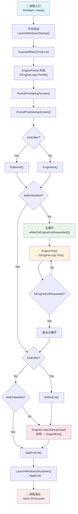
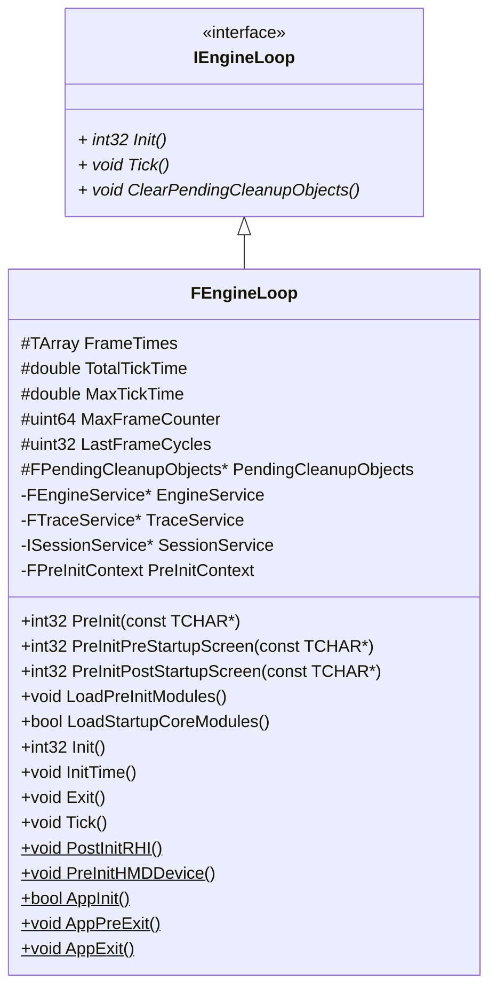

# 引擎的启动、初始化、主循环和退出

本文档基于 Unreal Engine 5.5.4 源码分析，核心代码文件：
- `Runtime/Launch/Public/LaunchEngineLoop.h`
- `Runtime/Launch/Private/LaunchEngineLoop.cpp`
- `Runtime/Launch/Private/Launch.cpp`
- `Runtime/Launch/Private/Windows/LaunchWindows.cpp`

## 主函数

在 Windows 平台下，主函数 `WinMain` 定义在 `LaunchWindows.cpp` 中：

```cpp
int32 WINAPI WinMain(_In_ HINSTANCE hInInstance, _In_opt_ HINSTANCE hPrevInstance, _In_ char* pCmdLine, _In_ int32 nCmdShow)
{
    int32 Result = LaunchWindowsStartup(hInInstance, hPrevInstance, pCmdLine, nCmdShow, nullptr);
    LaunchWindowsShutdown();
    return Result;
}
```
其中，`hInInstance`、`hPrevInstance`、`pCmdLine` 和 `nCmdShow` 都是 [Win32 API](https://learn.microsoft.com/zh-cn/windows/win32/) 中，[WinMain](https://learn.microsoft.com/zh-cn/windows/win32/api/winbase/nf-winbase-winmain) 函数的参数。在 WinMain 函数中：
- `LaunchWindowsStartup`：完成 Windows 平台下，环境的设置，并调用 `GuardedMain` 函数，进入引擎的设置与主循环
- `LaunchWindowsShutdown`：应用结束，调用 `FEngineLoop::AppExit()`

### `GuardedMain` 函数

`GuardedMain` 函数定义在 `Launch.cpp` 中：

```cpp
/**
 * Static guarded main function. Rolled into own function so we can have error handling for debug/ release builds depending
 * on whether a debugger is attached or not.
 */
int32 GuardedMain( const TCHAR* CmdLine )
```

`GuardedMain` 是受保护的 UE5 引擎主函数，它需要实现游戏引擎三个基本的流程：**初始化 Init**、**主循环 Tick** 和**退出 Exit**。其流程图如下：



> **GIsEditor**：是一个全局变量，表示当前是否是编辑器环境。如果是编辑器环境，初始化阶段将进入 `EditorInit()`，否则进入 `EngineInit()`。`EditorInit()` 还会执行 UnrealEd 模块的初始化。

> **bIsEmbedded 模式**：是把 Unreal Engine 作为一个库，嵌入到其他宿主程序中运行，而不是由 UE 自己作为独立进程控制完整生命周期。如果是 Embedded 模式，`GuardedMain` 将只完成引擎的初始化工作，不负责主循环和退出两个阶段。Tick 和 Exit 交由宿主程序执行。

## `FEngineLoop` 类

`GEngineLoop` 是定义在 `Launch.cpp` 中的**全局单例**，其类型是 `FEngineLoop`，是对引擎初始化、主循环和退出三阶段的封装。



## 引擎初始化

引擎的初始化可以分为 `PreInit` 和 `Init` 两个阶段：
1. `PreInit` 阶段又分为两个阶段：
   1. `FEngineLoop::PreInitPreStartupScreen`：完成启动画面之前的前置初始化工作
   2. `FEngineLoop::PreInitPostStartupScreen`：完成启动画面之后的前置初始化工作
2. `Init` 阶段根据环境的不同，执行不同的初始化函数。
   1. 编辑器环境 `GuardedMain()` 会调用 `EditorInit()` 函数
   2. 非编辑器环境 `GuardedMain()` 会调用 `EngineInit()` 函数。

### `PreInit` 阶段

在 `LaunchEngineLoop.cpp` 中，`FEngineLoop::PreInit()` 函数的定义如下：

```cpp
int32 FEngineLoop::PreInit(const TCHAR* CmdLine)
{
#if UE_ENABLE_ARRAY_SLACK_TRACKING
	// Any array allocations before this point won't have array slack tracking, although subsequent reallocations of existing arrays
	// will gain tracking if that occurs.  The goal is to filter out startup constructors which run before Main, which introduce a
	// ton of noise into slack reports.  Especially the roughly 30,000 static FString constructors in the code base, each with a
	// unique call stack, and all having a little bit of slack due to malloc bucket size rounding.
	ArraySlackTrackInit(); // 开启数组松弛追踪
#endif

	const int32 rv1 = PreInitPreStartupScreen(CmdLine);
	if (rv1 != 0)
	{
		PreInitContext.Cleanup();
		return rv1;
	}

	const int32 rv2 = PreInitPostStartupScreen(CmdLine);
	if (rv2 != 0)
	{
		PreInitContext.Cleanup();
		return rv2;
	}

	return 0;
}
```

#### `PreInitPreStartupScreen` 阶段

#### `PreInitPostStartupScreen` 阶段

### `EngineInit` 阶段

### `EditorInit` 阶段

## 主循环

## 退出

## 总结