# 游戏世界与 GamePlay 框架

**[玩法框架 GamePlay Framework](https://dev.epicgames.com/documentation/unreal-engine/gameplay-framework-in-unreal-engine?application_version=5.5)**：Unreal Engine 的玩法框架使用**客户端/服务器模式（C/S Model）**，以便支持[多人联机游戏](https://dev.epicgames.com/documentation/unreal-engine/networking-and-multiplayer-in-unreal-engine?application_version=5.5)，客户端与服务器的同步通过[网络复制 Network Replication](https://dev.epicgames.com/documentation/unreal-engine/detailed-actor-replication-flow-in-unreal-engine?application_version=5.5) 实现。如果开发的是单机游戏，也会存在一个“服务器”，服务器与客户端都运行在同一台主机上。Unreal Engine 的玩法框架主要包含如下类型：
1. GameInstance：表示一个正在运行的游戏实例。在联网游戏中，GameInstance 会同时出现在服务器和客户端中，但不会复制。
2. World：表示一个游戏世界，驱动游戏的 AI 系统、物理系统、渲染系统等。World 同时也是 Level 的容器，负责关卡内容的加卸载。在联网游戏中，World 会同时出现在服务器和客户端中，但不会复制。
3. Level：表示一个游戏关卡，是 Actor 的容器。在联网游戏中，Level 会同时出现在服务器和客户端中，但不会复制。
4. [Actor](https://dev.epicgames.com/documentation/unreal-engine/actors-in-unreal-engine?application_version=5.5)：表示一个游戏世界中的对象，是构建游戏世界的基础。Actor 拥有每帧更新的能力（Tick），用于处理逻辑和表现。Actor 也是 Component 的容器，为 Actor 添加 Component 拓展其行为与能力。Actor 可以是有实体可交互的对象（Pawn，Character 等），也可以是没有实体的数据和逻辑（AInfo，GameMode，WorldSettings 等）。在联网游戏中，Actor 提供了[网络复制](https://dev.epicgames.com/documentation/unreal-engine/detailed-actor-replication-flow-in-unreal-engine?application_version=5.5)的能力，默认关闭，按需开启。
5. [Component](https://dev.epicgames.com/documentation/unreal-engine/components-in-unreal-engine?application_version=5.5)：表示 Actor 的组成部分，用于为 Actor 添加特定的功能和行为。在联网游戏中，其复制行为由所属的 Actor 决定和自身的 bReplicates 属性共同决定。
6. [GameMode](https://dev.epicgames.com/documentation/unreal-engine/game-mode-and-game-state-in-unreal-engine?application_version=5.5)：表示游戏规则，同时也是一个非实体的 Actor，在加载关卡并创建游戏世界后实例化。在联网游戏中，只存在于服务器端，不会复制到客户端。
7. [GameState/PlayerState](https://dev.epicgames.com/documentation/unreal-engine/game-mode-and-game-state-in-unreal-engine?application_version=5.5)：用于在服务器和客户端之间同步游戏进程中各种数据，比如，玩家状态、任务状态、团队得分等等。在联网游戏中，由 GameMode 创建，通过网络复制到客户端。
8. [Pawn](https://dev.epicgames.com/documentation/unreal-engine/pawn-in-unreal-engine?application_version=5.5)：表示一个能被玩家或者 AI 控制的，有实体的 Actor。在联网游戏中，服务会持有权威实例，按需复制到客户端。
9. [Controller](https://dev.epicgames.com/documentation/unreal-engine/controllers-in-unreal-engine?application_version=5.5)：是一种非实体 Actor，用于控制 Pawn。[PlayerController（PC）](https://dev.epicgames.com/documentation/unreal-engine/player-controllers-in-unreal-engine?application_version=5.5) 和 [AIController](https://dev.epicgames.com/documentation/unreal-engine/ai-controllers-in-unreal-engine?application_version=5.5) 是 Controller 的两个重要派生类，前者接受玩家输入控制 Pawn，后者接受 AI 系统（行为树、状态机、寻路系统等）控制 Pawn。默认情况，Pawn 和 Controller 一一对应。在联网游戏中，客户端 PC 通过 Session 连接到服务器 GameMode，服务器会为此创建一个服务器 PC，服务器会有所有玩家的 PC，客户端只有自己的 PC；AIController 由服务器创建，不会复制到客户端，只需将 AIController 控制的 Pawn 复制到客户端即可。
10. HUD：表示游戏的用户界面（UI），是一个非实体 Actor。在联网游戏中，HUD 只存在于客户端，不会复制到服务器。


Unreal Engine GamePlay Framework 核心类型之间的继承关系：

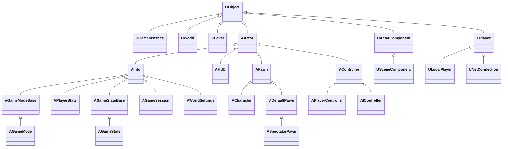


## GameInstance

`UGameInstance` 表示一个正在运行的游戏实例，是 Gameplay 框架中最顶层的对象，在非编辑器模式下是全局单例。生命周期横跨整个游戏进程，可以为项目派生一个自定义的 `UGameInstance`，并在 Project Settings 中设置，管理跨越不同游戏世界和游戏关卡的全局状态，比如：游戏的全局性配置、游戏的整体通关进度等。


> `UGameInstance` 的创建详见[引擎的启动、初始化、主循环和退出](../engine/engine_lifetime.md)。`UGameInstance` 实例在游戏发布环境和编辑器环境有所不同：
> - 如果是非编辑器环境，`UGameEngine` 会持有 `UGameInstance`，在 `UGameEngine::Init()` 函数中会读取 GameMapsSettings 配置，创建 `UGameInstance` 实例。
> - 如果是编辑器环境，`UUnrealEdEngine` 不会持有 `UGameInstance`，只有在启动 PIE（Play In Editor）时，按需为每个 PIE 实例创建 `UGameInstance` 实例。（`UEditorEngine::CreateInnerProcessPIEGameInstance`）

在非编辑器环境中，`UGameEngine` 持有 `UGameInstance`，`UGameInstance` 通过 `FWorldContext` 间接持有 `UWorld`（游戏世界）：

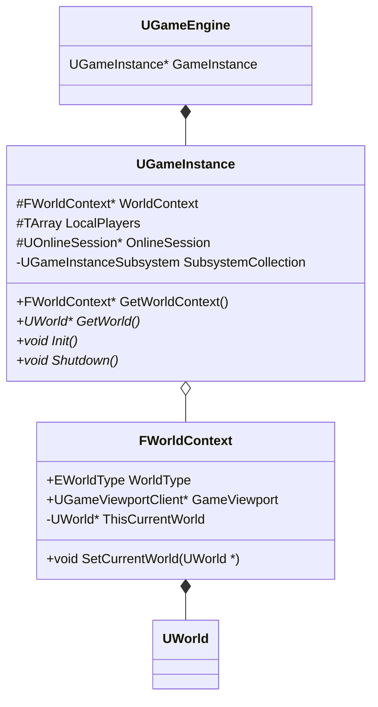

## World-Level

`UWorld` 表示一个游戏世界，`ULevel` 表示一个游戏关卡。`UWorld` 是 `ULevel` 的容器，一个 `UWorld` 可以包含多个 `ULevel`，而 `ULevel` 是 `AActor` 的容器，一个 `ULevel` 可以包含多个 `AActor`。

在 UE 中，Level 加载的经典方式是 [Level Streaming](https://dev.epicgames.com/documentation/unreal-engine/level-streaming-in-unreal-engine?application_version=5.5)，也即每个 `UWorld` 会有一个**持久化关卡 （Persistent Level）**，以及若干个**流式关卡（Streaming Level）**。

- **持久化关卡（Persistent Level）**：游戏世界的核心关卡，通常包含游戏的主要逻辑和基础设施，在游戏运行时随 World 一同创建。
- **流式关卡（Streaming Level）**：用于动态加/卸载内容，流式有两种设置：
  1. **Blueprint**：通过[关卡流送体（Level Streaming Volume）](https://dev.epicgames.com/documentation/unreal-engine/level-streaming-volumes-reference-in-unreal-engine?application_version=5.5)、[蓝图](https://dev.epicgames.com/documentation/unreal-engine/loading-and-unloading-levels-using-blueprints-in-unreal-engine?application_version=5.5)或 [C++ 代码](https://dev.epicgames.com/documentation/unreal-engine/loading-and-unloading-levels-using-cplusplus-in-unreal-engine?application_version=5.5)动态加载或卸载
  2. **Always Loaded**：与持久关卡一同加载，并设为可视状态，无法通过流送体、蓝图或代码加载。这种关卡也不被卸载，除非游戏世界切换

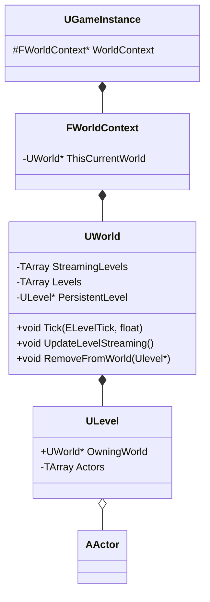

`UWorld` 类成员 | 描述
-|-
`Tick(...)` | 每帧更新游戏世界
`UpdateLevelStreaming()` | 更新关卡流式加载
`RemoveFromWorld(Ulevel*)` | 将指定关卡从游戏世界中移除


### 地图资产创建与管理

在 Content Browser 中，右键 Level 创建一个 *.umap 文件：


*.umap 类型资产称为 Map 文件，对应的 C++ 类型是 `UWorld`。打开一个 Map，在 Levels 面板中，可以为 World 配置关卡：


如果将 Map2 文件拖进 Map1 的 Levels 面板中，会将 Map2 的持久化关卡作为 Map1 的流式关卡，在 Levels 面板中可以为 Map2 配置流式加载方式：


### 关卡蓝图

点击按钮可以打开关卡蓝图：


或者在 Levels 面板中选择关卡点击按钮打开关卡蓝图：


关卡蓝图的资产类型为 `LevelScriptBlueprint`，是 EditorOnlyData，用于生成 `LevelScriptActor`。`LevelScriptActor` 是关卡蓝图运行时的实例化对象，继承自 `AActor`。当 `ULevel` 被加载并初始化时，会创建该 Level 的 `LevelScriptActor`；当 Level 被卸载或整个 World 被销毁时，该 Actor 一并清理。


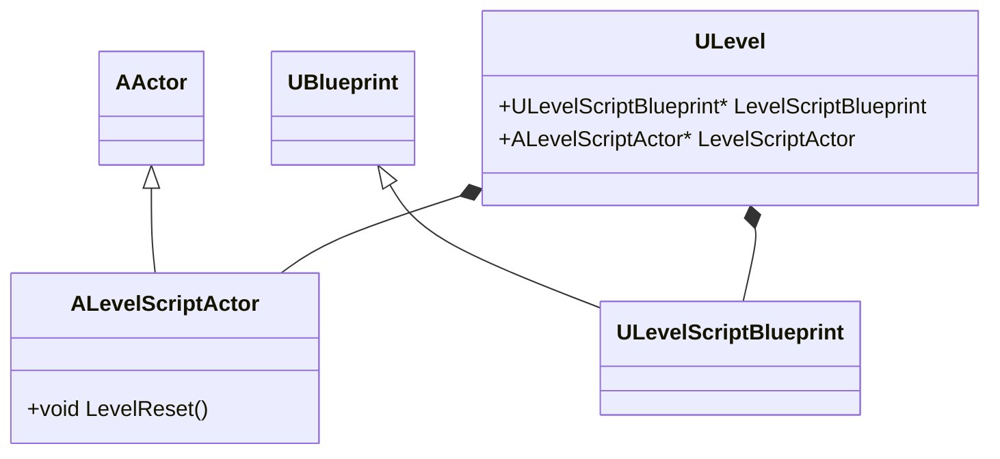

### Level Instance

如果将 Map2 的 *.umap 资产拖进 Map1 的场景中，那么 Map2 的 Persistent Level 作为一个 Actor 放置到 Map1 中，对应一个 `ALevelInstance` 对象。


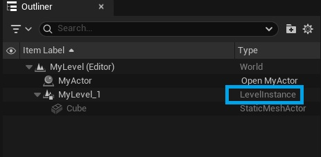

可以在大纲视图中选择若干个 Actor，右键选择 Create Level Instance，创建一个 *.umap 文件到 Content 中。

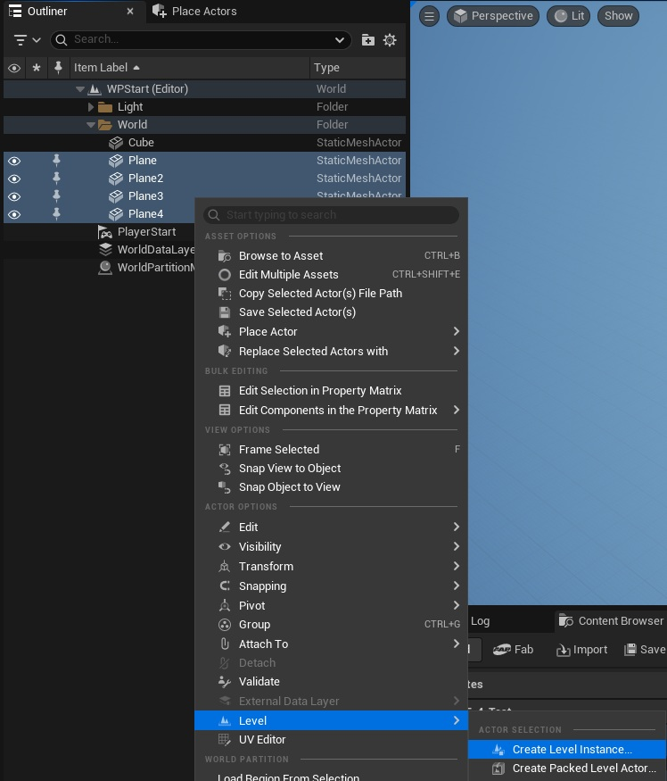

大纲视图中，Level Instance 中的 Actor 是置灰不可编辑状态。可以在选中后，在 Detial 面板点击编辑按钮修改 Level Instance。修改了此处的 Level Instance 后，等价于修改了 *umap 文件本身，所有使用了该 Level 的 Level Instance 和 Streaming Level 都会被同步修改。

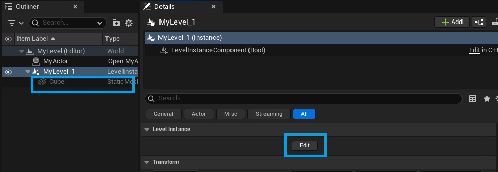

### World Settings


`AWorldSettings` 是 `AInfo` 的派生类型，表示一个游戏世界的设置。`AWorldSettings` 对象在 `UWorld::InitializeNewWorld(...)` 函数中被创建，并 Spawn 到 Persistent Level 中，其他 Streaming Level 都会读取这个 `AWorldSettings` 对象。`UWorld` 通过 Persistent Level 间接持有了 `AWorldSettings` 对象。
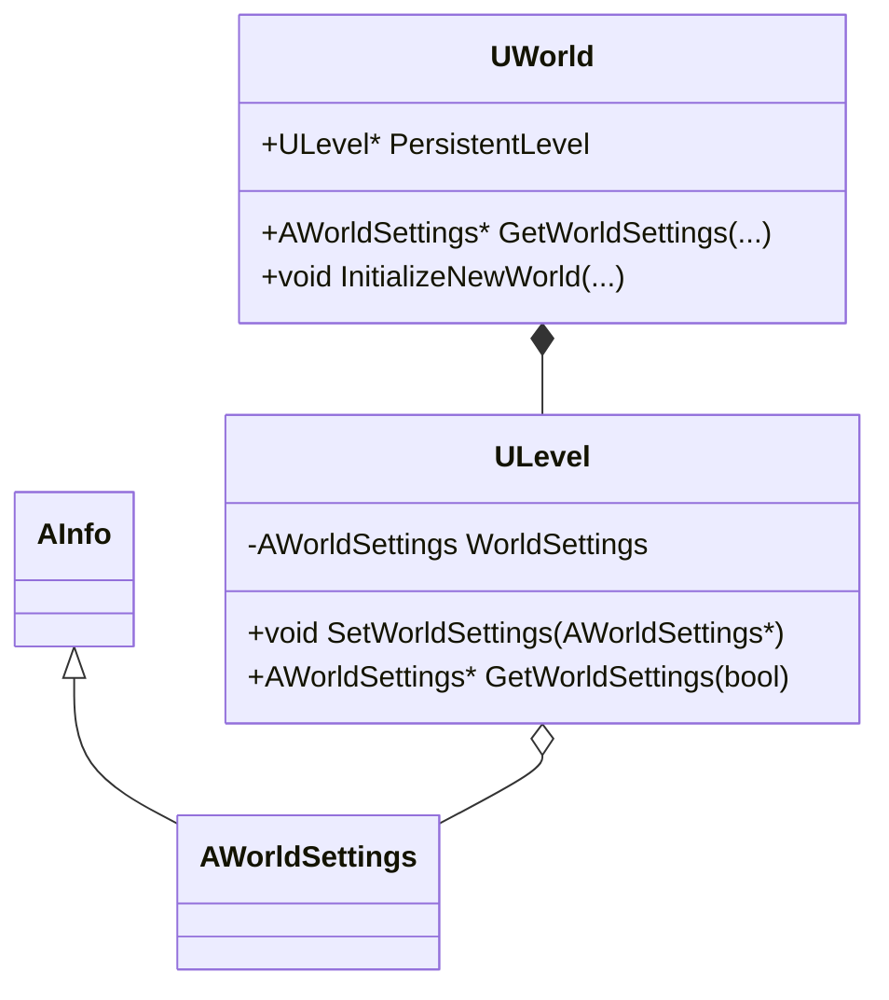

在 Window/World Settings 面板中可以对游戏世界进行设置，具体内容详见：[官方文档](https://dev.epicgames.com/documentation/unreal-engine/world-settings-in-unreal-engine?application_version=5.5)。其中 Game Mode 分组与 GamePlay 框架有关，后面会详细介绍。

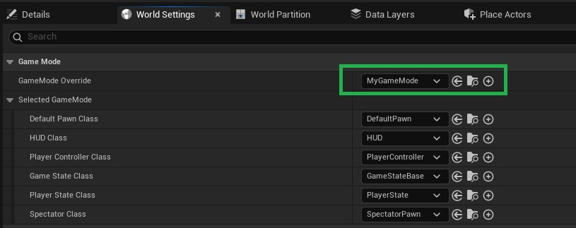

### World Partition

详见文档：[World Partition](../open_world/world_partition.md)

## Actor-Component

`AActor` 是游戏世界中的一个对象，即可以是有实体、可交互的具体对象（比如 `APawn`，`ACharacter` 等），也可以是无实体的逻辑对象（比如 `AController`），还可以是无实体的数据对象（比如 `AInfo`，`AWorldSettings` 等）。`UActorComponent` 表示一个组件，用于拓展 `AActor` 的功能和行为。在 Unreal Engine 中，Component 分为两大类：
1. **Actor Component**：`UActorComponent` 是所有组件的基类，提供特定的属性和行为
2. **Scene Component**：`USceneComponent` 继承者 `UActorComponent` ，提供了 Transform 属性，用于设置组件的空间变换与组件之间的附着（Attach）关系。每个 Actor 都有一个 RootComponent，它是一个 SceneComponent 类型，以便在游戏世界里自由放置（Placing），该 Actor 下的所有 SceneComponent 都会 Attach 到这个 RootComponent 下。Actor 的 RootComponent 也能 Attach 到另一个 Actor 的某个 SceneComponent 下。如果没有父 Actor，则默认 Attach 到世界坐标系下


> 如果 `UWorld` 是 `ULevel` 的容器，`ULevel` 是 `AActor` 的容器，那么 `AActor` 就是 `UActorComponent` 的容器。

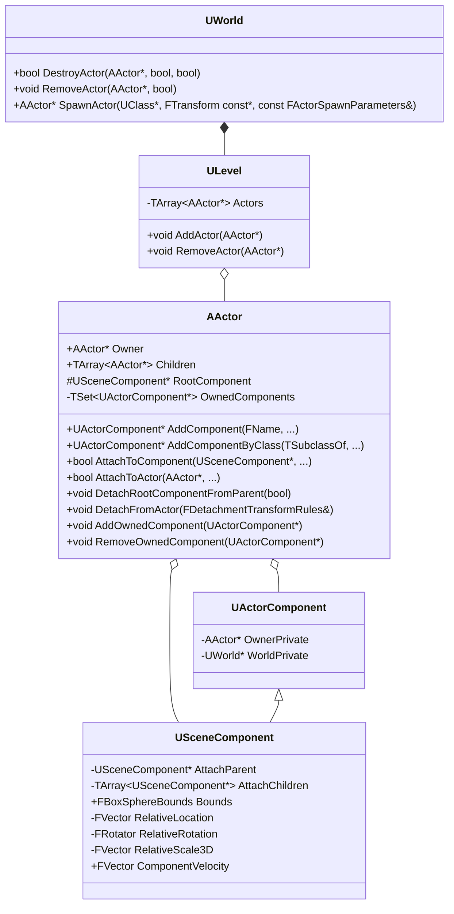


`UWorld` 类成员 | 描述 
-|-
`UWorld::SpawnActor(...)` | 用于在游戏世界中创建一个 Actor 实例，可以通过 `FActorSpawnParameters` 参数指定 Actor 创建时的各种设置。Actor 实例最终会归属一个 `ULevel`，如果没在 `FActorSpawnParameters` 中指定，则会归属 `UWorld::PersistentLevel` 持久化关卡。
`UWorld::RemoveActor(...)` | 移除 Actor 
`UWorld::DestroyActor(...)` | 销毁 Actor

### Actor 生命周期

详见文档：[Actor 生命周期](./actor_lifecycle.md)

### 网络复制

详见文档：[网络游戏与帧同步](./network_and_framesync.md)

### AInfo

`AInfo` 是 `AActor` 的派生类，表示一个无实体的数据逻辑对象。`AInfo` 

## Mode-State-Session

[官方文档](https://dev.epicgames.com/documentation/unreal-engine/game-mode-and-game-state-in-unreal-engine?application_version=5.5)

`AGameModeBase` 是 `AInfo` 的子类，用于定义游戏规则。

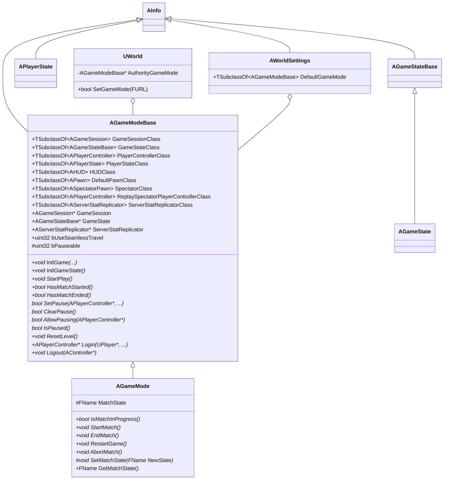

`UWorld` 成员 | 描述
-|-
`AuthorityGameMode` | 仅服务器的 `UWorld` 会持有一个权威的 `AGameModeBase` 实例，客户端 `UWorld` 的 `AuthorityGameMode` 为 nullptr。
`bool SetGameMode(FURL)` | 

`AGameModeBase` 成员 | 描述
-|-


在 World Settings 中，可以为游戏世界指定任意的 `AGameModeBase` 派生类型，并同时设置 GameMode 的 Default Pawn Class、HUD Class、Player Controller Class 等：


## Player-Pawn-Controller

`APawn` 表示一个可以被 `AController` 控制的 Actor，一个 Pawn 的 Controller 可以是玩家，也可以是 AI。`AController` 接受输入和做出决策，`Pawn` 负责做出表现。

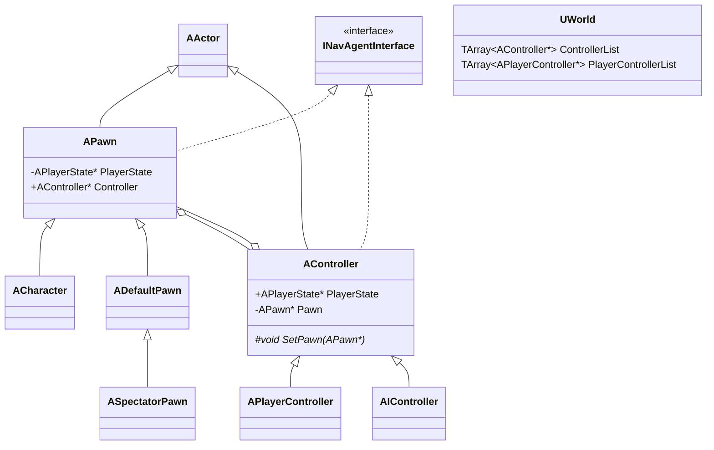

## Client-Server-Model

## Subsystem

## 初始化流程

```mermaid

```

节点|说明
-|-
`UEngine::LoadMap(...)` | 加载 Map，创建新 World