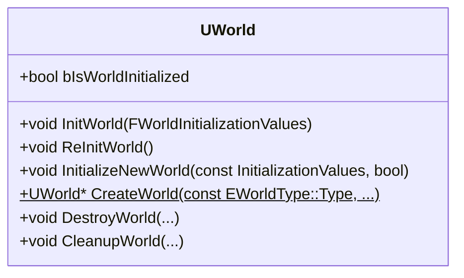

# 游戏世界的初始化



## CreateNewWorld

```cpp
UWorld* UWorld::CreateWorld(const EWorldType::Type InWorldType, bool bInformEngineOfWorld, FName WorldName, UPackage* InWorldPackage, bool bAddToRoot, ERHIFeatureLevel::Type InFeatureLevel, const InitializationValues* InIVS, bool bInSkipInitWorld)
{
	TRACE_CPUPROFILER_EVENT_SCOPE(UWorld::CreateWorld);

	if (InFeatureLevel >= ERHIFeatureLevel::Num)
	{
		InFeatureLevel = GMaxRHIFeatureLevel;
	}

	UPackage* WorldPackage = InWorldPackage;
	if ( !WorldPackage )
	{
		WorldPackage = CreatePackage(nullptr);
	}

	if (InWorldType == EWorldType::PIE)
	{
		WorldPackage->SetPackageFlags(PKG_PlayInEditor);
	}

	// Mark the package as containing a world.  This has to happen here rather than at serialization time,
	// so that e.g. the referenced assets browser will work correctly.
	if ( WorldPackage != GetTransientPackage() )
	{
		WorldPackage->ThisContainsMap();
	}

	// Create new UWorld, ULevel and UModel.
	const FString WorldNameString = (WorldName != NAME_None) ? WorldName.ToString() : TEXT("Untitled");
	UWorld* NewWorld = NewObject<UWorld>(WorldPackage, *WorldNameString);
	NewWorld->SetFlags(RF_Transactional);
	NewWorld->WorldType = InWorldType;
	NewWorld->SetFeatureLevel(InFeatureLevel);
	NewWorld->InitializeNewWorld(InIVS ? *InIVS : UWorld::InitializationValues().CreatePhysicsScene(InWorldType != EWorldType::Inactive).ShouldSimulatePhysics(false).EnableTraceCollision(true).CreateNavigation(InWorldType == EWorldType::Editor).CreateAISystem(InWorldType == EWorldType::Editor), bInSkipInitWorld);

	// Clear the dirty flags set during SpawnActor and UpdateLevelComponents
	WorldPackage->SetDirtyFlag(false);
	for (UPackage* ExternalPackage : WorldPackage->GetExternalPackages())
	{
		ExternalPackage->SetDirtyFlag(false);
	}

	if ( bAddToRoot )
	{
		// Add to root set so it doesn't get garbage collected.
		NewWorld->AddToRoot();
	}

	// Tell the engine we are adding a world (unless we are asked not to)
	if( ( GEngine ) && ( bInformEngineOfWorld == true ) )
	{
		GEngine->WorldAdded( NewWorld );
	}

	return NewWorld;
}
```

## InitializeNewWorld

```cpp
void UWorld::InitializeNewWorld(const InitializationValues IVS, bool bInSkipInitWorld)
{
	if (!IVS.bTransactional)
	{
		ClearFlags(RF_Transactional);
	}

	PersistentLevel = NewObject<ULevel>(this, TEXT("PersistentLevel"));
	PersistentLevel->Initialize(FURL(nullptr));
	PersistentLevel->Model = NewObject<UModel>(PersistentLevel);
	PersistentLevel->Model->Initialize(nullptr, 1);
	PersistentLevel->OwningWorld = this;

	// Create the WorldInfo actor.
	FActorSpawnParameters SpawnInfo; 

	// Mark objects are transactional for undo/ redo.
	if (IVS.bTransactional)
	{
		SpawnInfo.ObjectFlags |= RF_Transactional;
		PersistentLevel->SetFlags( RF_Transactional );
		PersistentLevel->Model->SetFlags( RF_Transactional );
	}
	else
	{
		SpawnInfo.ObjectFlags &= ~RF_Transactional;
		PersistentLevel->ClearFlags( RF_Transactional );
		PersistentLevel->Model->ClearFlags( RF_Transactional );
	}

#if WITH_EDITORONLY_DATA
	// Need to associate current level so SpawnActor doesn't complain.
	CurrentLevel = PersistentLevel;
#endif

	SpawnInfo.SpawnCollisionHandlingOverride = ESpawnActorCollisionHandlingMethod::AlwaysSpawn;
	// Set constant name for WorldSettings to make a network replication work between new worlds on host and client
	SpawnInfo.Name = GEngine->WorldSettingsClass->GetFName();
	AWorldSettings* WorldSettings = SpawnActor<AWorldSettings>(GEngine->WorldSettingsClass, SpawnInfo );

	// Allow the world creator to override the default game mode in case they do not plan to load a level.
	if (IVS.DefaultGameMode)
	{
		WorldSettings->DefaultGameMode = IVS.DefaultGameMode;
	}

	PersistentLevel->SetWorldSettings(WorldSettings);
	check(GetWorldSettings());
#if WITH_EDITOR
	WorldSettings->SetIsTemporarilyHiddenInEditor(true);

	// Check if newly created world should be partitioned
	if (IVS.bCreateWorldPartition)
	{
		// World partition always uses actor folder objects
		FLevelActorFoldersHelper::SetUseActorFolders(PersistentLevel, true);
		PersistentLevel->ConvertAllActorsToPackaging(true);
		
		check(!GetStreamingLevels().Num());
		
		UWorldPartition* WorldPartition = UWorldPartition::CreateOrRepairWorldPartition(WorldSettings);
		WorldPartition->bEnableStreaming = IVS.bEnableWorldPartitionStreaming;
	}
#endif

	if (!bInSkipInitWorld)
	{
		// If this isn't set, the PerfTrackers are already allocated in the constructor
		if (bDisableInGamePerfTrackersForUninitializedWorlds && !PerfTrackers)
		{
			PerfTrackers = new FWorldInGamePerformanceTrackers();
		}

		// Initialize the world
		InitWorld(IVS);

		// Update components.
		const bool bRerunConstructionScripts = !FPlatformProperties::RequiresCookedData();
		UpdateWorldComponents(bRerunConstructionScripts, false);
	}
}
```

## InitWorld

```cpp
void UWorld::InitWorld(const InitializationValues IVS)
{
	if (!ensure(!bIsWorldInitialized))
	{
		return;
	}

	// Reset flags in case of world reuse
	bIsLevelStreamingFrozen = false;
	bShouldForceUnloadStreamingLevels = false;

	FCoreUObjectDelegates::GetPostGarbageCollect().AddUObject(this, &UWorld::OnPostGC);

	InitializeSubsystems();

	FWorldDelegates::OnPreWorldInitialization.Broadcast(this, IVS);

	AWorldSettings* WorldSettings = GetWorldSettings();
	if (IVS.bInitializeScenes)
	{

	#if WITH_EDITOR
		bEnableTraceCollision = IVS.bEnableTraceCollision;
		bForceUseMovementComponentInNonGameWorld = IVS.bForceUseMovementComponentInNonGameWorld;
	#endif


		if (IVS.bCreatePhysicsScene)
		{
			// Create the physics scene
			CreatePhysicsScene(WorldSettings);
		}

		bShouldSimulatePhysics = IVS.bShouldSimulatePhysics;
		
		// Save off the value used to create the scene, so this UWorld can recreate its scene later
		bRequiresHitProxies = IVS.bRequiresHitProxies;
		GetRendererModule().AllocateScene(this, bRequiresHitProxies, IVS.bCreateFXSystem, GetFeatureLevel());
	}

	// Prepare AI systems
	if (WorldSettings)
	{
		if (IVS.bCreateNavigation || IVS.bCreateAISystem)
		{
			if (IVS.bCreateNavigation)
			{
				FNavigationSystem::AddNavigationSystemToWorld(*this, FNavigationSystemRunMode::InvalidMode, WorldSettings->GetNavigationSystemConfig(), /*bInitializeForWorld=*/false);
			}
			if (IVS.bCreateAISystem && WorldSettings->IsAISystemEnabled())
			{
				CreateAISystem();
			}
		}
	}
	
	if (GEngine->AvoidanceManagerClass != NULL)
	{
		AvoidanceManager = NewObject<UAvoidanceManager>(this, GEngine->AvoidanceManagerClass);
	}

	SetupParameterCollectionInstances();

	if (PersistentLevel->GetOuter() != this)
	{
		// Move persistent level into world so the world object won't get garbage collected in the multi- level
		// case as it is still referenced via the level's outer. This is required for multi- level editing to work.
		PersistentLevel->Rename(*PersistentLevel->GetName(), this);
	}

	Levels.Empty(1);
	Levels.Add( PersistentLevel );
	
	// If we are not Seamless Traveling remove PersistentLevel from LevelCollection if it is in a collection
	// The Level Collections will be filled already during Seamless Travel in 
	// UWorld::AsyncLoadAlwaysLoadedLevelsForSeamlessTravel()
	if (GEngine->GetWorldContextFromWorld(this) && !IsInSeamlessTravel())  
	{
		if (FLevelCollection* Collection = PersistentLevel->GetCachedLevelCollection())
		{
			Collection->RemoveLevel(PersistentLevel);
		}
	}
	
	PersistentLevel->OwningWorld = this;
	PersistentLevel->bIsVisible = true;

#if WITH_EDITOR
	RepairSingletonActors();
	RepairStreamingLevels();
#endif

	// initialize DefaultPhysicsVolume for the world
	// Spawned on demand by this function.
	DefaultPhysicsVolume = GetDefaultPhysicsVolume();

	// Find gravity
	if (GetPhysicsScene())
	{
		FVector Gravity = FVector( 0.f, 0.f, GetGravityZ() );
		GetPhysicsScene()->SetUpForFrame( &Gravity, 0, 0, 0, 0, 0, false);
	}

	// Create physics collision handler, if we have a physics scene
	if (IVS.bCreatePhysicsScene)
	{
		// First look for world override
		TSubclassOf<UPhysicsCollisionHandler> PhysHandlerClass = (WorldSettings ? WorldSettings->GetPhysicsCollisionHandlerClass() : nullptr);
		// Then fall back to engine default
		if(PhysHandlerClass == NULL)
		{
			PhysHandlerClass = GEngine->PhysicsCollisionHandlerClass;
		}

		if (PhysHandlerClass != NULL)
		{
			PhysicsCollisionHandler = NewObject<UPhysicsCollisionHandler>(this, PhysHandlerClass);
			PhysicsCollisionHandler->InitCollisionHandler();
		}
	}

	URL					= PersistentLevel->URL;
#if WITH_EDITORONLY_DATA
	CurrentLevel		= PersistentLevel;
#endif

	bAllowAudioPlayback = IVS.bAllowAudioPlayback;
	bDoDelayedUpdateCullDistanceVolumes = false;

#if WITH_EDITOR
	RepairDefaultBrush();

	if (!IsRunningCookCommandlet())
	{
		// invalidate lighting if VT is enabled but no valid VT data is present or VT is disabled and no valid non-VT data is present.
		for (auto Level : Levels) //Note: PersistentLevel is part of this array
		{
			if (Level && Level->MapBuildData)
			{
				if (Level->MapBuildData->IsLightingValid(GetFeatureLevel()) == false)
				{
					Level->MapBuildData->InvalidateSurfaceLightmaps(this);
				}
			}
		}
	}

#endif // WITH_EDITOR

	// update it's bIsDefaultLevel
	bIsDefaultLevel = (FPaths::GetBaseFilename(GetMapName()) == FPaths::GetBaseFilename(UGameMapsSettings::GetGameDefaultMap()));

	ConditionallyCreateDefaultLevelCollections();

	// We're initialized now.
	bIsWorldInitialized = true;
	bHasEverBeenInitialized = true;

	// Call the general post initialization delegates
	FWorldDelegates::OnPostWorldInitialization.Broadcast(this, IVS);

	PersistentLevel->PrecomputedVisibilityHandler.UpdateScene(Scene);
	PersistentLevel->PrecomputedVolumeDistanceField.UpdateScene(Scene);
	PersistentLevel->InitializeRenderingResources();
	PersistentLevel->OnLevelLoaded();

	IStreamingManager::Get().AddLevel(PersistentLevel);

	PostInitializeSubsystems();

	BroadcastLevelsChanged();

	FAssetRegistryModule& AssetRegistryModule = FModuleManager::LoadModuleChecked<FAssetRegistryModule>(TEXT("AssetRegistry"));
	AssetRegistryModule.Get().AssetTagsFinalized(*this);
}
```