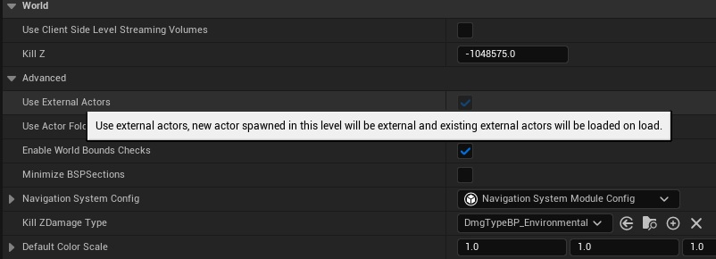

# One File Per Actor（OFPA）

在传统的关卡编辑过程中，Actor 的实例数据是保存在关卡中。当有人修改关卡中的 Actor 时，会更改 *umap 文件，不利于多人协作编辑关卡。在 World Settings 中，开启 Use External Asset ，启用 [One File Per Actor（OFPA）](https://dev.epicgames.com/documentation/unreal-engine/one-file-per-actor-in-unreal-engine?application_version=5.5)，可将 Actor 数据保存到外部的 *.uasset 文件中（具体保存路径在：`Content/__ExternalActors__/Maps/`）。

> 如果时是 World Partition 的 Level， 默认开启 OFPA

