# 世界分区

在 UE4 时代用于开放式世界大地图的资源流送 World Composition 到了 UE5 升级为 [World Partition](https://dev.epicgames.com/documentation/unreal-engine/world-partition-in-unreal-engine?application_version=5.5)，并且作为创建新项目的默认流送设置。如果使用 World Partition，整个世界将只有一个持久关卡，并且不能使用 Levels 面板手动添加子关卡。

## 开启 WP

在 World Settings 中开启 World Partition：

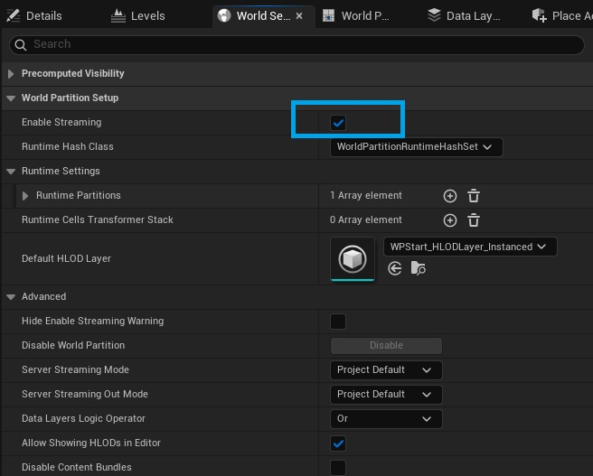

点击 Build/Build World Partition Editor Minimap 构建小地图：

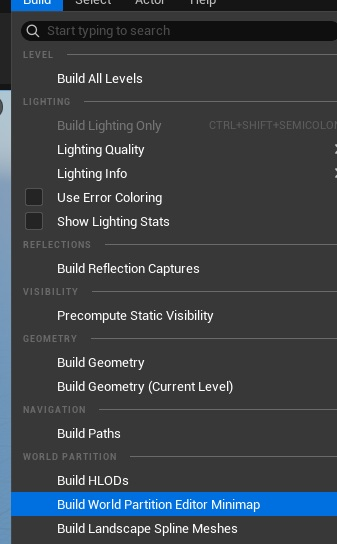

可以在 Window/World Partition/World Partition Editor 视窗可以看到空间被划分称均匀网格（Grid），右键小地图可以在编辑模式下强制加载/卸载地块、移动相机等：

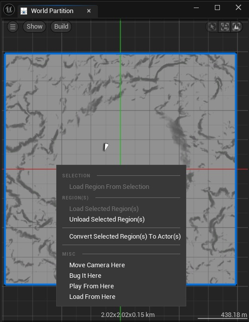

如果 Level 中的 Actor 被标记为 Is Spatially Loaded，将会自动划分到一个单元格中：

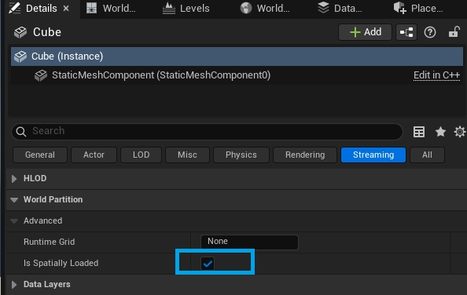

在运行时，World Partition 系统，会根据[流送源（Streaming Source）](https://dev.epicgames.com/documentation/unreal-engine/world-partition-in-unreal-engine#streaming-sources)所在的位置、方向、半径、优先级等信息，将其附近的单元格都加载出来。

### 核心类型

`UWorldPartition` 是 World Partition 系统的核心类，由 `AWorldSettings` 持有 `UWorldPartition` 实例，`UWorld::GetWorldPartition()` 通过 Persistent Level 可以间接访问当前的 `UWorldPartition` 实例。

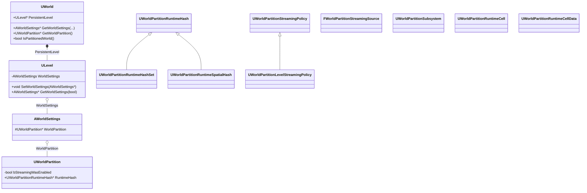

## Data Layer

[Data Layer](https://dev.epicgames.com/documentation/unreal-engine/world-partition---data-layers-in-unreal-engine?application_version=5.5) 是 World Partition 的一个重要系统，通过 Data Layer 对 Actor 分层，可以管理一组 Actor 的加载和卸载。

使用 Data Layer 之前，需要先创建一个 Data Layer 资产：

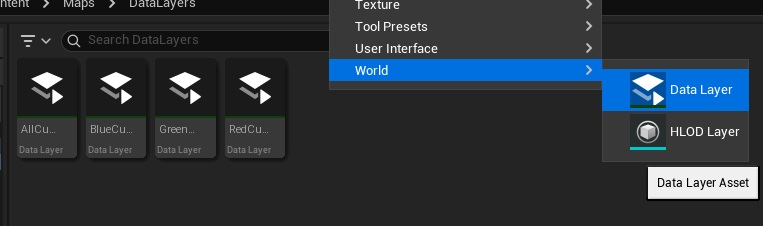

在 Actor 的 Details 面板中，可以为其指定 Data Layer，同一个 Actor 可以指定多个 Data Layer：

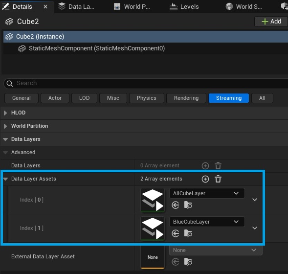

在 Window/World Partition/Data Layers Outliner 视窗中可以可以管理当前 Level 的 Data Layers：

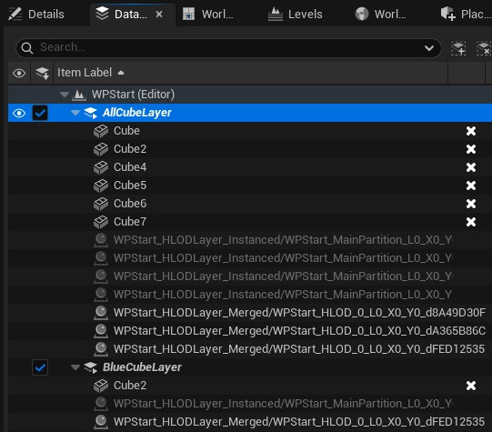

### AWorldDataLayers Actor

每个 World Partition 的 Level 都有一个 `AWorldDataLayers` 的 Actor，它是 `AInfo` 的派生类：

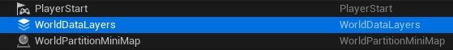

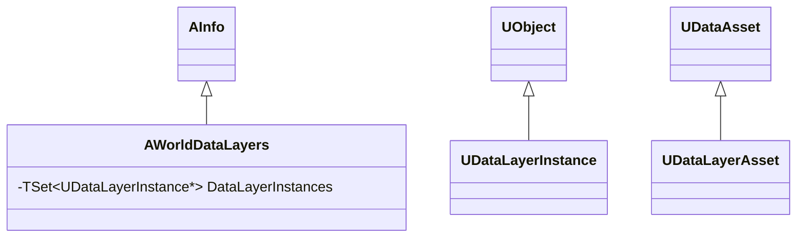

## HLOD

[HLOD（Hierarchical Level of Detail）](https://dev.epicgames.com/documentation/unreal-engine/world-partition---hierarchical-level-of-detail-in-unreal-engine?application_version=5.5)是 World Partition 中基于 Cell 的 LOD，在创建 World Parition 场景时，会同步创建 HLOD Layer 资产，并在 World Settings 里面默认设置：

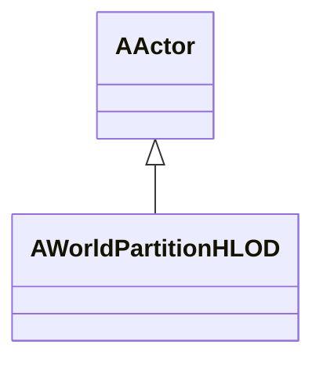