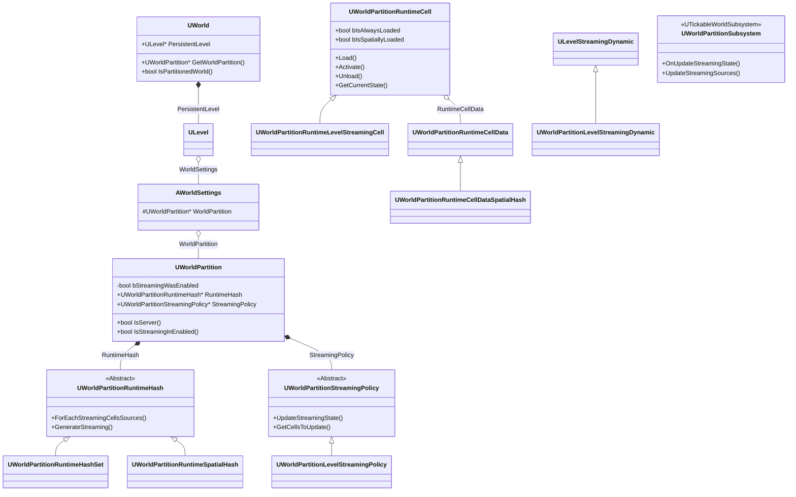
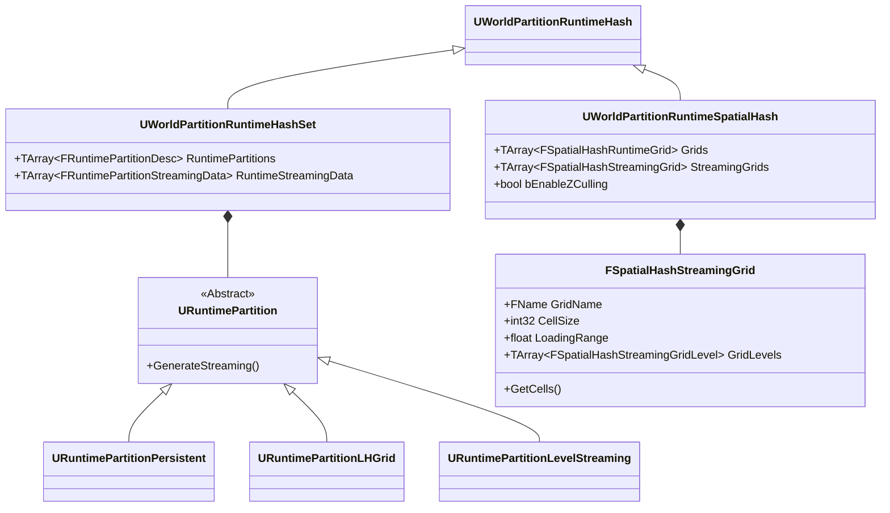
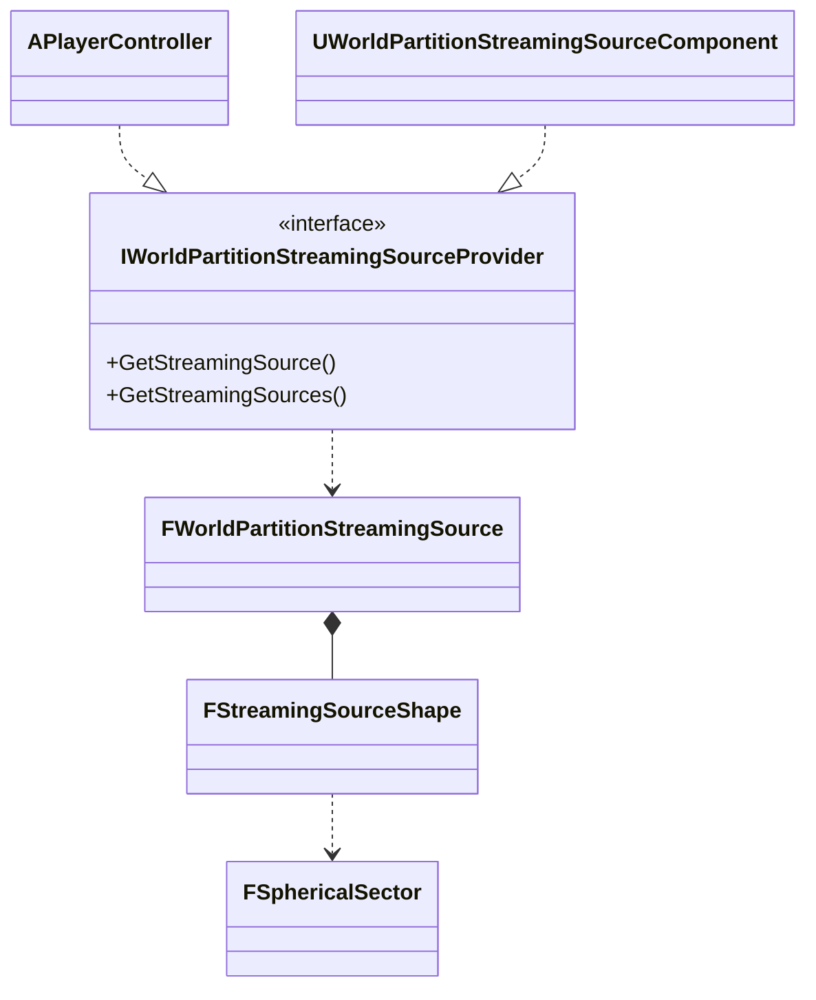
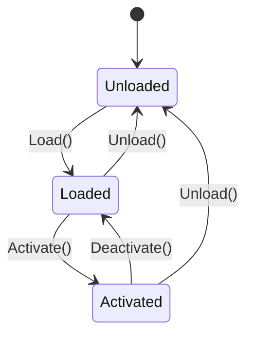
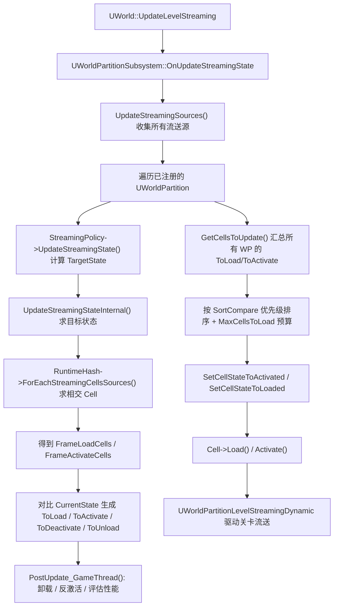
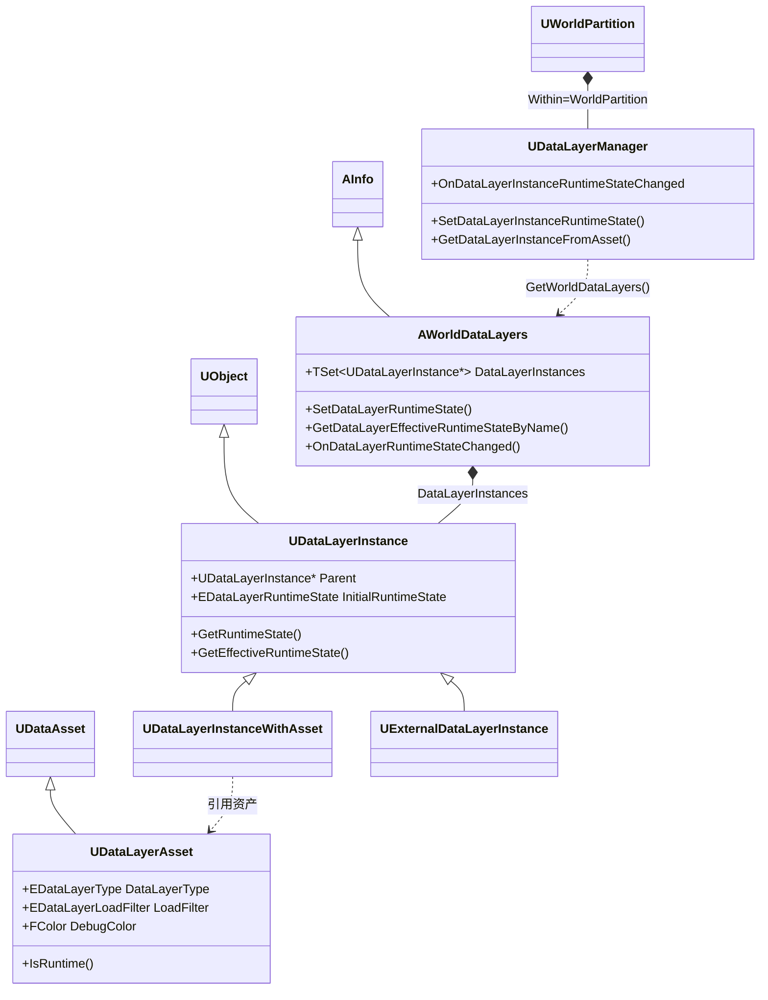
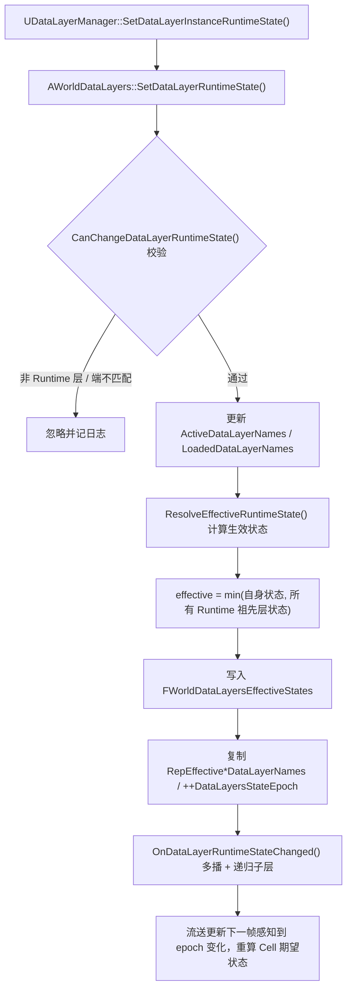
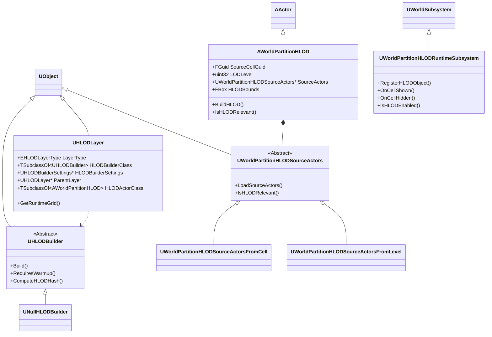
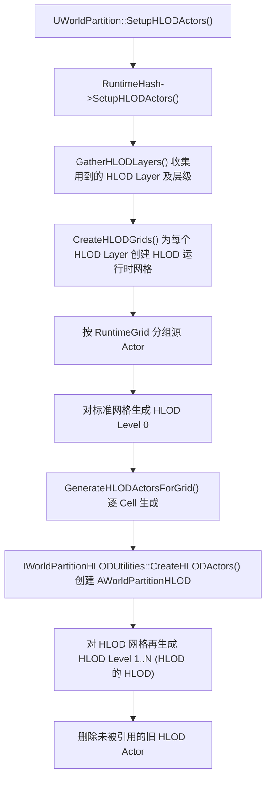
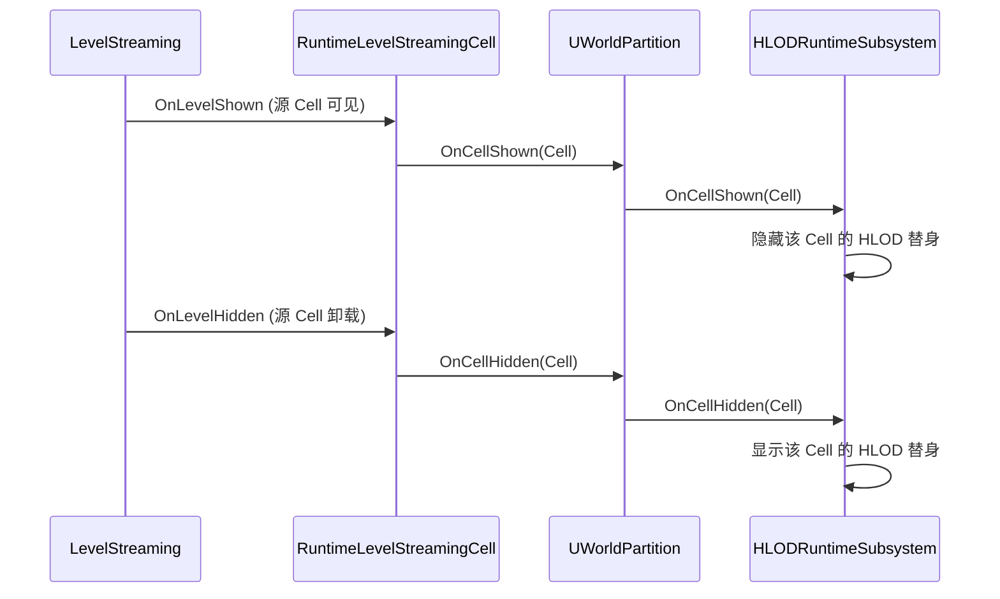

# 世界分区

在 UE4 时代用于开放式世界大地图的资源流送 World Composition 到了 UE5 升级为 [World Partition](https://dev.epicgames.com/documentation/unreal-engine/world-partition-in-unreal-engine?application_version=5.5)，并且作为创建新项目的默认流送设置。如果使用 World Partition，整个世界将只有一个持久关卡，并且不能使用 Levels 面板手动添加子关卡。

> 以下源码分析基于 `Engine/Source/Runtime/Engine` 模块的 WorldPartition 目录。核心思路：编辑器期把世界按空间网格（或自定义分区器）切割成一个个**流送单元（Streaming Cell）**，每个 Cell 对应一个独立的关卡包；运行期由**流送策略**根据**流送源（Streaming Source）**的位置，决定哪些 Cell 需要 加载 / 激活 / 卸载。

## 开启 WP

在 World Settings 中开启 World Partition：


点击 Build/Build World Partition Editor Minimap 构建小地图：


可以在 Window/World Partition/World Partition Editor 视窗可以看到空间被划分成均匀网格（Grid），右键小地图可以在编辑模式下强制加载/卸载地块、移动相机等：


如果 Level 中的 Actor 被标记为 Is Spatially Loaded，将会自动划分到一个单元格中：


在运行时，World Partition 系统，会根据[流送源（Streaming Source）](https://dev.epicgames.com/documentation/unreal-engine/world-partition-in-unreal-engine#streaming-sources)所在的位置、方向、半径、优先级等信息，将其附近的单元格都加载出来。

### 核心类型

`UWorldPartition` 是 World Partition 系统的核心类，由 `AWorldSettings` 持有 `UWorldPartition` 实例，`UWorld::GetWorldPartition()` 通过 Persistent Level 可以间接访问当前的 `UWorldPartition` 实例。

`UWorldPartition` 内部持有两个关键对象：

- **`UWorldPartitionRuntimeHash`（`RuntimeHash`）**：描述世界**如何被空间划分**，保存所有流送 Cell 的划分结构。编辑器期负责生成（`GenerateStreaming`），运行期负责根据流送源查询相交的 Cell。
- **`UWorldPartitionStreamingPolicy`（`StreamingPolicy`）**：描述世界**如何被流送加载**，负责每帧更新流送状态（加载/激活/卸载 Cell）。`Within = WorldPartition`。




---

## 空间划分（Spatial Partition）

空间划分的核心是 **`UWorldPartitionRuntimeHash`**。它是一个抽象基类，引擎提供两种实现：

| 实现类 | 说明 |
| --- | --- |
| `UWorldPartitionRuntimeSpatialHash` | **默认实现**，使用均匀多层级空间哈希网格，是 5.4 之前的唯一实现。 |
| `UWorldPartitionRuntimeHashSet` | 5.4 引入，基于可插拔的 **Runtime Partition**，支持非均匀、自定义的分区方式。 |

### RuntimeHash 的两种划分方式



### SpatialHash：多层级均匀网格

`UWorldPartitionRuntimeSpatialHash` 的核心是 **`FSquare2DGridHelper`**，它把世界构建为一个**金字塔式的多层级 2D 网格**：

- **Level 0（最底层）**：单元格尺寸 = 配置的 `CellSize`，网格数量为覆盖世界范围所需的最少数量（向上取 2 的幂）。
- **每一层往上**：单元格尺寸翻倍（`CellSize <<= 1`），网格数量减半（`GridSize >>= 1`），因此每层覆盖的总区域大小不变。
- **最高层（顶层）**：只有一个单元格，即 **Always Loaded Cell**（常驻加载，存放始终需要存在的 Actor）。

每个网格单元用三维整数坐标 `FGridCellCoord`（`FInt64Vector3`）标识，其中 `X/Y` 是该层的网格坐标，`Z` 存储**层级（Level）**。

层级数量与世界范围的关系（见 `FSquare2DGridHelper` 构造函数）：

```
GridSize      = 2 * CeilToDouble(WorldBoundsMaxExtent / CellSize)   // 向上取 2 的幂
GridLevelCount = FloorLog2(GridSize) + 1
```

网格的可配置参数由 `FSpatialHashRuntimeGrid` 描述（默认值：`CellSize = 12800`、`LoadingRange = 25600`）：

| 属性 | 含义 |
| --- | --- |
| `CellSize` | 单元格尺寸（单位：cm），决定空间粒度。 |
| `LoadingRange` | 加载半径，流送源会加载这个半径范围内的 Cell。 |
| `Origin` | 网格原点，所有层级的划分都以此为基准。 |
| `Priority` | 该网格相对其它网格的流送优先级。 |
| `bBlockOnSlowStreaming` | 加载过慢时是否阻塞（配合 `BlockTillLevelStreamingCompleted`）。 |

#### 编辑器期：生成流送网格

`GenerateStreaming()` 在编辑器期（保存 / 构建）被调用，完成两件事：

1. **`GetPartitionedActors()`**：遍历所有 `Is Spatially Loaded` 的 Actor（集），决定它们落入哪个网格单元：
   - 默认按**包围盒**放置：从底层往上查找第一个"能用单个单元格完整包含该包围盒"的层级（`GetNumIntersectingCells == 1`），因此跨越多个单元格的 Actor 会被提升到更高层级；
   - 对于**分区 Actor（`APartitionActor`**，如 Level Instance）默认改用**位置**放置（`bPlacePartitionActorsUsingLocation`），按其中心点选取最匹配尺寸的层级与单元格；小 Actor 也可按位置放置（`bPlaceSmallActorsUsingLocation`，默认关闭）；
   - 找不到合适单元格的 Actor 落入顶层的 **Always Loaded Cell**。
2. **`CreateStreamingGrid()`**：把每个网格单元转换为一个流送 Cell（`UWorldPartitionRuntimeCell`），并挂到 `FSpatialHashStreamingGrid` 的对应层级上。如果该单元内含有 Data Layer Actor，还会按 Data Layer 组合进一步拆分成多个 `FSpatialHashStreamingGridLayerCell`。

> `bUseAlignedGridLevels`：控制上层网格是否与下层单元格边界对齐。关闭后可避免"跨格 Actor 提升层级"产生的固定模式伪影；配合 `bSnapNonAlignedGridLevelsToLowerLevels` 可把激活的 Cell 吸附回下层单元格。

#### 运行期：查询相交的 Cell

运行期的 `FSpatialHashStreamingGrid::GetCells()` 用于求"流送源的形状与哪些 Cell 相交"：

- 用 `FSquare2DGridHelper::ForEachIntersectingCells()` 从底层到顶层逐层遍历与流送源形状相交的网格单元；
- 对每个命中的网格单元，取出其中的所有 `UWorldPartitionRuntimeCell`；
- 若开启 `bEnableZCulling`，还会做一次 **Z 轴裁剪**（比较 Cell 的 Z 包围盒与流送源形状的 Z 范围），剔除高度上不重叠的 Cell；
- 根据 Cell 的 Data Layer 期望状态（`GetCellEffectiveWantedState`）和流送源的 `TargetState`，把 Cell 归入 **激活集（OutActivateCells）** 或 **加载集（OutLoadCells）**。

### HashSet：可插拔的 Runtime Partition

`UWorldPartitionRuntimeHashSet` 不再固定使用均匀网格，而是把划分逻辑抽象为 **`URuntimePartition`**。每个分区器（`FRuntimePartitionDesc`）由一个主分区层（`MainLayer`）和若干 HLOD 分区层（`HLODSetups`）组成。

引擎内置的分区器：

| 分区器 | 说明 |
| --- | --- |
| `URuntimePartitionPersistent` | 常驻分区，把匹配的 Actor 放进一个始终加载的 Cell。 |
| `URuntimePartitionLHGrid` | 轻量层级网格（Light Hierarchical Grid），按 `CellSize`（默认 25600）划分均匀网格。 |
| `URuntimePartitionLevelStreaming` | 按 Actor 所属的关卡名（`RuntimeGrid` 的第二个 Token）分组，每组一个 Cell；非空间加载的 Actor 归入 `PersistentLevel` Cell。 |

运行期，每个分区的流送数据保存在 `FRuntimePartitionStreamingData` 中，分为两类：

- **`SpatiallyLoadedCells`**：空间加载的 Cell，会构建一个静态空间索引（`FStaticSpatialIndex`，使用 **Hilbert 曲线排序的 R-Tree**，见 `FStaticSpatialIndexType`）以加速空间查询；
- **`NonSpatiallyLoadedCells`**：非空间加载的 Cell（通常配合 Data Layer 按需加载），不参与空间查询。

### 流送单元（UWorldPartitionRuntimeCell）

`UWorldPartitionRuntimeCell` 是最小的流送单元，代表"一组会被一起加载/卸载的 Actor"，也是编辑器期划分结果与运行期流送对象之间的桥梁。每个 Cell 对应一个独立的关卡包（PIE / Game 时按需加载）。

关键属性与方法：

| 成员 | 含义 |
| --- | --- |
| `bIsSpatiallyLoaded` | 是否按空间加载（否则由 Data Layer 等按需加载）。 |
| `bIsAlwaysLoaded` | 是否常驻加载（如顶层 Always Loaded Cell）。 |
| `RuntimeCellData` | 指向 `UWorldPartitionRuntimeCellData`，缓存排序/包围盒等数据。 |
| `Load() / Unload()` | 加载 / 卸载该 Cell（进入 `Loaded` 状态）。 |
| `Activate() / Deactivate()` | 激活 / 反激活该 Cell（进入 `Activated` 状态）。 |
| `GetCurrentState()` | 返回当前 `EWorldPartitionRuntimeCellState`。 |

`UWorldPartitionRuntimeLevelStreamingCell` 是最常用的实现：它内部持有一个 `UWorldPartitionLevelStreamingDynamic`（`ULevelStreamingDynamic` 的派生类），`Load()/Activate()` 实际上是转发给这个流送关卡对象。`UWorldPartitionRuntimeCellDataSpatialHash` 则在 `CellData` 中额外保存空间哈希特有的排序信息（`Position`、`Extent`）。

---

## 加载策略（Loading / Streaming）

加载策略由 **`UWorldPartitionStreamingPolicy`** 及其派生类 `UWorldPartitionLevelStreamingPolicy` 实现，`UWorldPartitionSubsystem` 每帧驱动它更新流送状态。

### 流送源（Streaming Source）

流送源描述"从哪里、以什么形状、加载到什么状态"。运行时由 `UWorldPartitionSubsystem::UpdateStreamingSources()` 收集所有注册的 **`IWorldPartitionStreamingSourceProvider`**：

- **`APlayerController`**：默认实现了该接口，用玩家视点的位置和朝向作为流送源；
- **`UWorldPartitionStreamingSourceComponent`**：可挂在任意 Actor 上的组件，自定义形状、优先级、目标状态；
- 编辑器 SIE 模式下的视口、`AWorldPartitionReplay` 回放等。

每个流送源由 `FWorldPartitionStreamingSource` 描述：

| 成员 | 含义 |
| --- | --- |
| `Location` / `Rotation` | 流送源位置与朝向。 |
| `TargetState` | 目标状态：`Loaded`（只加载）或 `Activated`（加载并激活，默认）。 |
| `Priority` | `EStreamingSourcePriority`，`Highest=0` ~ `Lowest=255`，默认 `Normal=128`。 |
| `bBlockOnSlowLoading` | 该源是否参与"加载过慢阻塞"判断。 |
| `TargetGrids` / `TargetBehavior` | 限定该源影响的网格（Include / Exclude）。 |
| `Shapes` | 一组 `FStreamingSourceShape`，为空时退化为以 `LoadingRange` 为半径的球。 |
| `Velocity` | 由子系统根据位置历史自动估算，用于排序。 |

**`FStreamingSourceShape`** 支持自定义加载形状：

- `bUseGridLoadingRange`：`true` 时使用网格的 `LoadingRange`（可乘 `LoadingRangeScale`），`false` 时使用 `Radius`；
- `bIsSector`：是否为**球扇形（Spherical Sector）**，配合 `SectorAngle` 限制朝向角度；
- 内部统一表示为 **`FSphericalSector`**（中心、半径、轴向、张角），`Angle = 360°` 时退化为普通球。



### Cell 状态机

每个 Cell 处于三种状态之一（`EWorldPartitionRuntimeCellState`）：



- **`Unloaded`**：关卡包未加载，不在世界中；
- **`Loaded`**：关卡包已加载但**未加入世界**（不渲染、不 Tick），通常用于"预加载"以减少激活时的卡顿；
- **`Activated`**：关卡已加入世界，参与渲染和逻辑。

### 每帧流送更新流程

`UWorld::UpdateLevelStreaming()` 会调用 `IStreamingWorldSubsystemInterface::OnUpdateStreamingState()`，即 `UWorldPartitionSubsystem::OnUpdateStreamingState()`，进而执行 `UpdateStreamingStateInternal()`。整体流程如下：



关键步骤说明：

1. **收集流送源**：`UpdateStreamingSources()` 汇总所有 Provider 的流送源，并估算各源的速度、计算哈希（用于判断流送状态是否变化、避免无效更新）。服务器开启流送时还会略微扩大加载半径（`ExtraRadius`），保证服务器比客户端多加载一点。

2. **计算目标状态**：`UpdateStreamingStateInternal()`（可配置为异步任务执行）调用 `RuntimeHash->ForEachStreamingCellsSources()`，让具体的 `RuntimeHash` 实现（SpatialHash / HashSet）根据每个流送源的形状求出相交的 Cell，并按流送源的 `TargetState` 分成：
   - **`FrameActivateCells`**：本帧应激活的 Cell；
   - **`FrameLoadCells`**：本帧应加载的 Cell（激活优先，会从加载集中移除）。

3. **对比当前状态生成操作列表**：与 `CurrentState`（当前已加载/已激活的 Cell）做差集，得到四个目标集合：

   | 集合 | 含义 |
   | --- | --- |
   | `ToActivateCells` | 需要激活的 Cell（新进入加载半径且需激活）。 |
   | `ToLoadCells` | 需要加载的 Cell。 |
   | `ToDeactivateCells` | 需要反激活的 Cell（仅服务器，激活 → 加载）。 |
   | `ToUnloadCells` | 需要卸载的 Cell（离开加载半径，且不在本帧加载/激活集）。 |

4. **游戏线程应用（卸载 / 反激活 / 性能评估）**：每个 `UWorldPartition` 的 `StreamingPolicy->UpdateStreamingState()` 算出 `TargetState` 后，由 `PostUpdateStreamingStateInternal_GameThread()` 处理需要立即生效的变化：`SetCellsStateToUnloaded()` → `Cell->Unload()`；服务器上的 `ToDeactivateCells` → `SetCellStateToLoaded()`（先 `Deactivate()` 但保留为 Loaded，确保客户端不会把已被服务器反激活的关卡变为可见）；并评估本帧流送性能。

5. **汇总排序与预算加载 / 激活**：所有 `UWorldPartition` 更新完毕后，`UWorldPartitionSubsystem::UpdateStreamingStateInternal()` 通过 `GetCellsToUpdate()` 汇总所有 WP 的 `ToLoadCells / ToActivateCells`，用 `UWorldPartitionRuntimeCell::SortCompare()` 按优先级统一排序，然后在 **并发加载上限 `MaxCellsToLoad`**（CVar `wp.Runtime.MaxLoadingStreamingCells`，默认 4，仅作用于客户端）的预算内依次调用 `SetCellStateToActivated()` → `Cell->Activate()` 与 `SetCellStateToLoaded()` → `Cell->Load()`。对仍处于等待状态的 Cell，还会通过 `SetStreamingPriority()` 写入 `ULevelStreaming` 的加载优先级，让 `UWorld::UpdateLevelStreaming` 按正确顺序处理。

6. **关卡流送执行**：`Cell->Load()/Activate()` 最终转发到 `UWorldPartitionLevelStreamingDynamic`，后者作为标准 `ULevelStreamingDynamic` 由引擎的关卡流送系统完成异步加载、加入世界（AddToWorld）、渲染可见性切换，并通过 `OnLevelShown/OnLevelHidden` 回调通知 Cell 与 `UWorldPartitionStreamingPolicy`。

> **性能优化**：
> - `UpdateStreamingStateInternal()` 可在异步任务中执行（CVar `wp.Runtime.UpdateStreaming.EnableAsyncUpdate`），计算目标状态不占用游戏线程；
> - 当流送源哈希（位置 / 朝向经过量化）与上一帧一致时，会跳过本帧更新；
> - 一个 World 中存在多个 `UWorldPartition`（如 Level Instance 注入）时，可按时间预算分帧增量更新（CVar `wp.Runtime.UpdateStreamingStateTimeLimit`）。

### Cell 排序与优先级

当多个 Cell 等待加载时，`UWorldPartitionRuntimeCellData` 缓存了用于排序的信息，`SortCompare()` 据此决定加载顺序：

- **`CachedMinSourcePriority`**：影响该 Cell 的最高流送源优先级；
- **`CachedMinSquareDistanceToSource`**：Cell 到最近流送源的平方距离（越近越优先）；
- **`CachedMinSpatialSortingPriority`**：综合距离与朝向角度的空间优先级（正对方向优先）；
- **`CachedMinBlockOnSlowStreamingRatio`**：用于判断流送性能状态。

### 流送性能与阻塞

`UWorldPartitionRuntimeHash::GetStreamingPerformance()` 会根据待激活 Cell 的加载进度评估流送性能（`EWorldPartitionStreamingPerformance`）：`Good` / `Slow` / `Critical` / `Immediate`。评估依据是 Cell 到流送源的距离与加载半径的比值（`DistanceToCell / LoadingRange`），相关阈值由以下控制台变量控制：

| CVar | 默认值 | 含义 |
| --- | --- | --- |
| `wp.Runtime.SlowStreamingRatio` | 0.25 | 判定流送"过慢"的距离比值。 |
| `wp.Runtime.BlockOnSlowStreamingRatio` | 0.25 | 判定流送需要"阻塞"的距离比值。 |
| `wp.Runtime.SlowStreamingWarningFactor` | 2.0 | 达到 ratio × factor 时开始向用户告警（屏幕提示）。 |
| `wp.Runtime.BlockOnSlowStreaming` | 1 | 全局开关，是否允许流送过慢时阻塞。 |

当性能恶化且流送源标记了 `bBlockOnSlowStreaming` 时，引擎会通过 `UWorld::BlockTillLevelStreamingCompleted` 阻塞，直到关键 Cell 加载完成，避免玩家看到空洞（pop-in）。在阻塞期间（`IsInBlockTillLevelStreamingCompleted`），每帧加载数量上限 `MaxCellsToLoad` 会被放宽为不限，以尽快完成加载。

### 查询流送是否完成

蓝图 / C++ 可通过 `UWorldPartitionSubsystem::IsStreamingCompleted()` 查询指定位置、指定状态（`Loaded` / `Activated`）的 Cell 是否已流送完成，常用于在传送、加载完成后触发游戏逻辑。

---

## Data Layer

[Data Layer](https://dev.epicgames.com/documentation/unreal-engine/world-partition---data-layers-in-unreal-engine?application_version=5.5) 是 World Partition 的一个重要系统，通过 Data Layer 对 Actor 分层，可以管理一组 Actor 的加载和卸载。

使用 Data Layer 之前，需要先创建一个 Data Layer 资产：


在 Actor 的 Details 面板中，可以为其指定 Data Layer，同一个 Actor 可以指定多个 Data Layer：


在 Window/World Partition/Data Layers Outliner 视窗中可以管理当前 Level 的 Data Layers：


### 核心类型（代码层面）

Data Layer 涉及"资产 → 实例 → 容器 → 管理器"四个层次的对象：



| 类型 | 职责 |
| --- | --- |
| `UDataLayerAsset` | **共享资产**，定义 Layer 的固有属性：类型 `DataLayerType`（`Runtime` / `Editor`，即 `EDataLayerType`）、加载过滤 `LoadFilter`、调试颜色。多个 Level 可引用同一个资产。 |
| `UDataLayerInstance` | **每个 Level 中的实例**，存储该 Level 内的运行状态：`InitialRuntimeState`、父子层级（`Parent` / `Children`）、编辑器可见性等。 |
| `UDataLayerInstanceWithAsset` | 默认实例类，内部通过 `DataLayerAsset` 引用共享资产（`GetAsset()`）。 |
| `AWorldDataLayers` | 每个 World Partition Level 唯一的 `AInfo` 派生 Actor，持有该 Level 的所有 `DataLayerInstances`，负责运行状态的设置、生效与网络同步。 |
| `UDataLayerManager` | `Within = WorldPartition` 的**运行期入口**（5.3 起取代已废弃的 `UDataLayerSubsystem`），提供设置 / 查询状态与蓝图事件。 |

**类型与加载过滤**：`EDataLayerLoadFilter`（定义在 `UDataLayerAsset` 上）决定该层状态由谁管理、是否复制：

| LoadFilter | 行为 |
| --- | --- |
| `None` | 客户端、服务器都参与，状态由**服务器权威设置并复制**给客户端。 |
| `ClientOnly` | 只在客户端生效，状态由客户端本地修改。 |
| `ServerOnly` | 只在服务器生效。 |

**Actor 关联**：Actor 上通过 `AActor::DataLayerAssets`（`TArray<TSoftObjectPtr<UDataLayerAsset>>`）记录它所属的 Data Layer 资产（5.8 起；旧的名字数组 `FActorDataLayer DataLayers` 已废弃）。编辑器期流送生成时，这些引用会被解析为 `FDataLayerInstanceNames` 存进 Actor 描述（`FWorldPartitionActorDesc`），并随 Cell 划分带入流送数据。

### 运行状态与生效逻辑

`EDataLayerRuntimeState` 有三个值，与 Cell 状态**同名同序**（源码中特意用 `static_assert` 保证了这一点，两者可直接比较）：

```
Unloaded → Loaded（加载但不可见） → Activated（加载且可见）
```

**初始状态**：`AWorldDataLayers::InitializeDataLayerRuntimeStates()` 在世界开始时，把每个 Runtime 层设置为其 `InitialRuntimeState`；还可用 `InitialRuntimeStateOverrideCVarName` 指定一个控制台变量在加载时覆写初始状态（0/1/2 对应三种状态）。

**状态修改路径**（以服务器设置一个 `None` 层为例）：



要点：

- **校验**：`CanChangeDataLayerRuntimeState()` 拒绝非法修改——非 Runtime 层（`NotRuntime`）、在服务器改 ClientOnly 层（`ClientOnlyFromServer`）、在客户端改 ServerOnly 层（`ServerOnlyFromClient`）、客户端改权威层（`AuthoritativeFromClient`）。
- **父子层级**：Data Layer 实例可以组成树（`Parent` / `Children`）。生效状态沿祖先链取**最小值**——父层是 `Loaded` 时，即使子层被设为 `Activated`，生效状态也只有 `Loaded`。状态变化会递归传播给所有子层。
- **复制**：`None` 层的状态集合（`RepActiveDataLayerNames` / `RepEffectiveActiveDataLayerNames` 等）由服务器复制到客户端；`ClientOnly` / `ServerOnly` 层只存在本地集合（`LocalActiveDataLayerNames` 等）。
- **Epoch**：每次生效状态变化 `++DataLayersStateEpoch`，流送系统用它判断缓存是否失效（见下节）。

### 与流送的配合：Cell 期望状态

`UWorldPartition::DataLayersLogicOperator`（`EWorldPartitionDataLayersLogicOperator::Or / And`）决定"一个 Cell 属于多个 Data Layer 时"的组合语义，解析发生在 `FWorldPartitionStreamingContext::ResolveDataLayerRuntimeState()`：

- Cell 没有任何 Data Layer → 直接 `Activated`（按空间流送处理）；
- 若 Cell 关联了 **External Data Layer**，其生效状态作为该 Cell 能达到的**状态上限**；
- `Or`（默认）：任一数据层为 `Activated` → Cell 可达上限状态；任一为 `Loaded` → `Loaded`；否则 `Unloaded`；
- `And`：所有数据层都 `Activated` 才达上限，以此类推。

解析结果经 `UWorldPartitionRuntimeCell::GetCellEffectiveWantedState()` 缓存（以 `DataLayersStateEpoch` 比对，状态变化后才重新计算，线程安全）。随后在 `FSpatialHashStreamingGrid::GetCells()` 中：

- 期望状态为 `Loaded` / `Activated` 且与流送源形状相交的 Cell，进入加载集 / 激活集；
- 期望状态为 `Unloaded` 的 Cell 被排除，并在策略对比时进入卸载集。

由此：**非空间加载（`bIsSpatiallyLoaded = false`）的 Cell 完全由 Data Layer 状态驱动**（`GetNonSpatiallyLoadedCells()` 无条件收集后同样按期望状态过滤），适合任务剧情、昼夜切换、DLC 内容等场景。编辑器期，同一网格单元内不同 Data Layer 组合的 Actor 会被拆分为不同的 `FSpatialHashStreamingGridLayerCell`，进而生成不同的 Cell。

### Editor Data Layer

`DataLayerType = Editor` 的层不参与运行期流送（`GetInitialRuntimeState()` 对非 Runtime 层恒返回 `Unloaded`），只控制编辑器内的加载与可见性：

- `bIsInitiallyVisible` / `IsVisible()`：视口中是否显示该层的 Actor；
- `bIsInitiallyLoadedInEditor` / `IsLoadedInEditor()`：编辑器是否加载该层内容，`UDataLayerLoadingPolicy` 可自定义解析规则；
- Outliner 中选中某个 Editor 层后，新放置的 Actor 会自动归入该层（`AWorldDataLayers::CurrentDataLayers` 放置上下文）。

### 调试命令

| 命令 | 作用 |
| --- | --- |
| `wp.Runtime.SetDataLayerRuntimeState <State> <DataLayerNames>` | 设置 Runtime 层状态（`Unloaded` / `Loaded` / `Activated`）。 |
| `wp.Runtime.ToggleDataLayerActivation <DataLayerNames>` | 切换层的激活状态。 |
| `wp.Runtime.DumpDataLayers` | 打印所有数据层及状态到日志。 |

`UDataLayerManager::DrawDataLayersStatus()` 还会在屏幕上绘制 Loaded（青色）/ Active（绿色）/ Unloaded（灰色）的数据层列表。

### External Data Layer（EDL）简介

EDL（`UExternalDataLayerAsset` / `UExternalDataLayerInstance`）把一整个**外部世界的内容**当作一个数据层注入当前世界（典型用途：Level Instance 注入的可流送子世界、DLC）。注入的流送内容（`URuntimeHashExternalStreamingObjectBase`）挂在一个 `RootExternalDataLayerInstance` 下；前面提到的"生效状态上限"即由 EDL 的状态控制——EDL 为 `Unloaded` 时，其下所有内容的 Cell 都不会被加载。

### AWorldDataLayers Actor

每个 World Partition 的 Level 都有一个 `AWorldDataLayers` 的 Actor，它是 `AInfo` 的派生类：


---

## HLOD

[HLOD（Hierarchical Level of Detail）](https://dev.epicgames.com/documentation/unreal-engine/world-partition---hierarchical-level-of-detail-in-unreal-engine?application_version=5.5)是 World Partition 中基于 Cell 的 LOD：把一组源 Cell 里的 Actor 预先烘焙成一个"低精度替身"（合并 / 简化 / 实例化的网格），当源 Cell 因距离太远被卸载时，用这个替身顶上，从而在远处仍能看到景物轮廓、减少 pop-in。在创建 World Partition 场景时，会同步创建 HLOD Layer 资产，并在 World Settings 里面默认设置。

### 核心类型



| 类型 | 职责 |
| --- | --- |
| `UHLODLayer` | HLOD **配置资产**：定义生成方式（`LayerType`）、构建器、设置、父层级（`ParentLayer`，用于 HLOD 的 HLOD）。 |
| `AWorldPartitionHLOD` | 生成出来的 HLOD **替身 Actor**，记录 `SourceCellGuid`（对应哪个源 Cell）、`LODLevel`、包围盒等。`IsRuntimeOnly() = true`，只在运行期存在。 |
| `UWorldPartitionHLODSourceActors` | 描述 HLOD 的**源 Actor 来源**（`FromCell` / `FromLevel`），构建时按需加载源 Actor。 |
| `UHLODBuilder` | 实际执行网格构建的**构建器**基类，子类在 `WorldPartitionHLODUtilities` 插件中（Instancing / MeshMerge / MeshSimplify / MeshApproximate）。 |
| `UWorldPartitionHLODRuntimeSubsystem` | 运行期负责 **HLOD 与源 Cell 的显隐切换**。 |

### HLOD Layer 类型

`UHLODLayer::LayerType`（`EHLODLayerType`）决定用哪种方式生成替身网格：

| 类型 | 说明 |
| --- | --- |
| `Instancing` | 实例化：直接把源网格用 `HLODInstancedStaticMeshComponent` 实例化，不做合并。 |
| `MeshMerge` | 合并网格（Merged Mesh）：把多个网格合并成一个。 |
| `MeshSimplify` | 简化网格（Simplified Mesh）：合并并减面。 |
| `MeshApproximate` | 近似网格（Approximated Mesh）：用近似算法重建网格，质量最高、开销最大。 |
| `Custom` | 自定义构建器（`HLODBuilderClass`）。 |
| `CustomHLODActor` | 自定义 HLOD Actor，配合 `LinkedLayer` 控制可见性。 |

> 注：早期版本中 `UHLODLayer` 还直接持有 `CellSize / LoadingRange / bIsSpatiallyLoaded` 等网格参数（现已标记 `UE_DEPRECATED`）。在当前版本中，HLOD 网格的设置改由分区（SpatialHash 的 grid / HashSet 的 `FRuntimePartitionHLODSetup`）提供。

### HLOD 生成流程（编辑器 / Commandlet）

HLOD 通过 `WorldPartitionBuilderCommandlet`（Build HLODs）在编辑器期生成，入口是 `UWorldPartition::SetupHLODActors()`：



关键点：

1. **逐 Cell 生成**：`GenerateHLODActorsForGrid()` 先用与普通网格相同的 `GetPartitionedActors()` 把源 Actor 划分到网格，然后**跳过 Always Loaded Cell**（常驻 Cell 不需要 HLOD），对每个有内容的 Cell 调用 `CreateHLODActors()` 生成一个 `AWorldPartitionHLOD`，并记录源 Cell 的 `CellGuid`。
2. **HLOD 的 HLOD（层级化）**：`HLODLevel = 0` 的 HLOD 来自标准网格的 Cell；随后把这些 HLOD Actor 当作新的源，为更高一级的 HLOD 网格（由 `ParentLayer` 关联）再生成 `HLODLevel = 1, 2, ...`，形成层级 LOD。
3. **HLOD 网格更"粗"**：`CreateHLODGrids()` 创建的 HLOD 网格通常拥有更大的 `CellSize` 和 `LoadingRange`，并标记 `bClientOnlyVisible = true`、较低的 `Priority`（`100 + HLODLevel`），网格名形如 `HLOD{Level}_{CellSize}m_{LoadingRange}m`。因为加载半径更大，HLOD 会比源 Cell **更早、在更远处**被加载。
4. **实际构建**：`AWorldPartitionHLOD::BuildHLOD()` 调用对应的 `UHLODBuilder::Build()`，加载源 Actor（`UWorldPartitionHLODSourceActors::LoadSourceActors()`）并生成合并 / 简化后的组件。

### HLOD 运行时切换

运行期由 **`UWorldPartitionHLODRuntimeSubsystem`** 负责"源 Cell 与 HLOD 替身"的显隐互换。它为每个源 Cell 维护一份 `FCellData`：

```cpp
struct FCellData
{
    bool bIsCellVisible = false;                 // 源 Cell 当前是否可见
    TArray<IWorldPartitionHLODObject*> LoadedHLODs; // 该 Cell 对应的 HLOD 替身
};
```

切换逻辑：

- **`RegisterHLODObject()`**：`AWorldPartitionHLOD` 加载后，按 `SourceCellGuid` 注册到对应 Cell 的 `LoadedHLODs`；若源 Cell 当前不可见，立即显示该 HLOD。
- **`OnCellShown()`**（源 Cell 变为可见）→ 隐藏该 Cell 的所有 HLOD（`SetVisibility(false)`），把画面交还给高精度的源 Cell。
- **`OnCellHidden()`**（源 Cell 被卸载 / 隐藏）→ 显示该 Cell 的 HLOD（`SetVisibility(WorldPartitionHLODEnabled)`），用替身补上远景。

这条调用链由流送系统驱动：关卡流送完成后 `OnLevelShown/OnLevelHidden` → `UWorldPartitionRuntimeLevelStreamingCell::OnCellShown/OnCellHidden` → `UWorldPartition::OnCellShown/OnCellHidden` → `UWorldPartitionHLODRuntimeSubsystem::OnCellShown/OnCellHidden`（同时也通知 `StreamingPolicy`）。



**Warmup（预热）**：HLOD 使用虚拟纹理（VT）/ Nanite 时，直接切换可能出现首帧低分辨率。`CanMakeVisible()` 会在 HLOD 就绪前阻止其所在 Cell 可见，并通过 `wp.Runtime.HLOD.WarmupNumFrames`（默认 5 帧）延迟切换，预热相关资源。相关开关：`wp.Runtime.HLOD.WarmupEnabled` / `WarmupVT` / `WarmupNanite`。

**全局开关**：控制台命令 `wp.Runtime.HLOD 0/1` 可整体开关 HLOD 的加载与渲染；`StreamingPolicy` 在 `ShouldSkipDisabledHLODCell` 中据此跳过被禁用的 HLOD Cell（`Cell->GetIsHLOD() && !IsHLODEnabled()`）。
