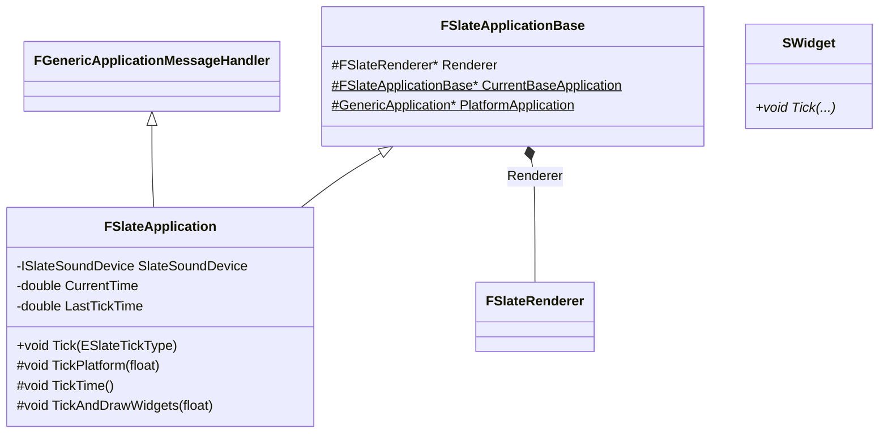
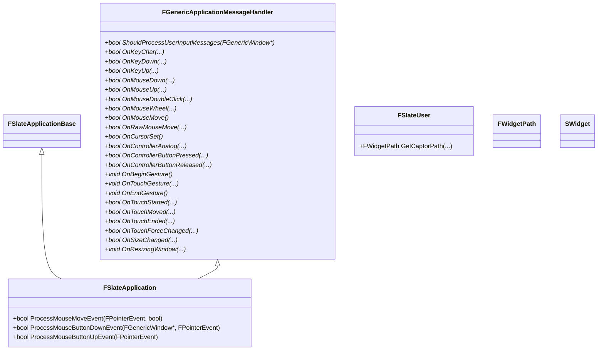
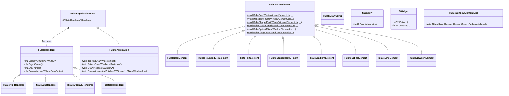

# Slate Appliction



## Tick 流程

在 `FEngineLoop::Tick()` 的中会调用 `FSlateApplication::Tick()`，驱动 `FSlateApplication` 的每帧刷新，大致流程为：
1. Pump OS 输入消息
2. 调用 `FSlateApplication::TickPlatform(float DeltaTime)`，让 Slate 处理输入消息
3. 调用 `FSlateApplication::TickTime()`，更新当前时间
4. 调用 `FSlateApplication::TickAndDrawWidgets(float DeltaTime)`，绘制 Slate 界面

> 特殊情况：有模态窗口（Modal Window）或阻塞调试时，主循环可能处于一种“局部阻塞”状态，如果还等正常主循环 PumpMessages，模态对话框可能收不到输入，此时 Slate 自己会 PumpMessages

## 输入消息处理




`FGenericApplicationMessageHandler` 是一个接口类，定义与平台无关的用户输入消息处理函数。`FSlateApplication` 继承了 `FGenericApplicationMessageHandler`，并实现这些函数，并调用了对应的 Process 函数，最终将输入消息传递给 Slate 界面。

`FSlateApplication` 在 `OnXXX(...)` 函数中，将平台输入变成 Slate 事件，然后调用 `ProcessXXXEvent(...)` 函数处理事件。比如接受到 `MouseDown` 消息：

> Slate 事件定义在 `Engine/Source/Runtime/SlateCore/Public/Input/Events.h` 中

```cpp
bool FSlateApplication::OnMouseDown( const TSharedPtr< FGenericWindow >& PlatformWindow, const EMouseButtons::Type Button, const FVector2D CursorPos )
{
	FKey Key = TranslateMouseButtonToKey( Button );

	FPointerEvent MouseEvent(
		GetUserIndexForMouse(),
		CursorPointerIndex,
		CursorPos,
		GetLastCursorPos(),
		PressedMouseButtons,
		Key,
		0,
		PlatformApplication->GetModifierKeys()
		);

	return ProcessMouseButtonDownEvent( PlatformWindow, MouseEvent );
}
```

在事件处理函数 `ProcessXXXEvent(...)` 中，引入几个概念：
1. `FSlateUser`：Slate 用户，是 Slate 层对一个独立输入源的抽象，比如：键盘、鼠标、手柄、触摸板等。当一个新的输入源连接到系统时，Slate 会创建一个新的 `FSlateUser` 对象
2. `FWidgetPath`：Slate Widget 路径，表示一个 Widget 在 Slate 层级中路径
3. 


## Slate 渲染



`FSlateDrawElement` 是 Slate 渲染的单元的基类，描述“绘制什么、在哪里、如何混合”。控件**不直接调用 GPU**，而是通过 `FSlateDrawElement` 的静态工厂方法声明绘制元素。

`FSlateRenderer` 是 Slate UI 渲染器的抽象基类。


## Slate 音效