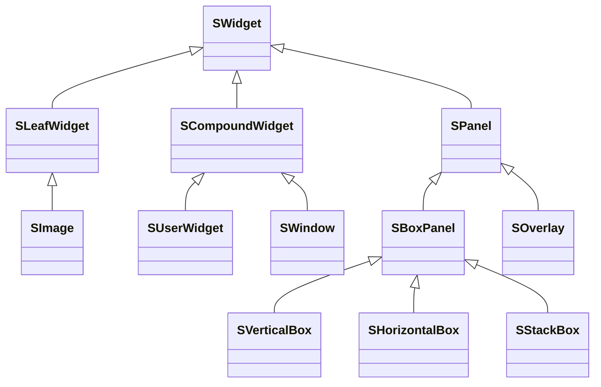
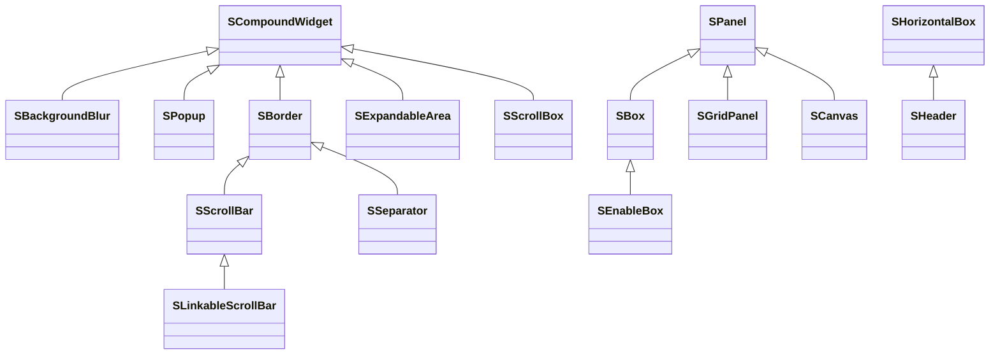
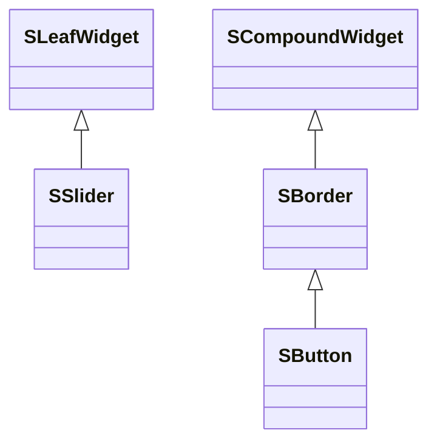

# Slate UI Widget

Slate UI 由两个 Modules 组成：
1. `SlateCore` 是 Slate UI 的核心模块，提供了最基础的 UI 类型和功能 
2. `Slate` 是对 `SlateCore` 的扩展，提供了更多的 UI 控件（Widget）类型。

在 `SlateCore` 中，定义了 Slate UI 最基础的类 —— `SWidget` 及其基础派生类：

`SWidget` 是所有 Slate UI 控件的基类

`SCompoundWidget` 是 Slate 里最常用的派生基类之一。它适合表示“有一个根槽位，内部再包一棵子树”的控件。

`SLeafWidget`：没有子树的控件，如 `SImage` 等。

`SPanel` 适合实现真正的“容器型布局控件”，例如垂直排列、水平排列、网格、Overlay 等。`SVerticalBox`、`SHorizontalBox`、`SOverlay` 这类控件，本质上都属于“管理多个子控件布局”的范畴。你只有在默认容器不满足需求时，才需要自己写 `SPanel` 子类。

在 `Slate` 中，定义了更多的 UI 控件类型。大致分为如下几类：

1. 布局 Layout：`SBorder`、`SBox`、`SScrollBar`
2. 输入 Input：`SButton`，`SCheckBox`，`SSlider`
3. 文本 Text：
4. 视图 View：`SListView`、`STreeView`
5. 颜色 Color
6. 图像 Image
7. 其他 Other：`SDockTab`，`SBreadcrumbTrail`

### 布局类型

### 输入类型

