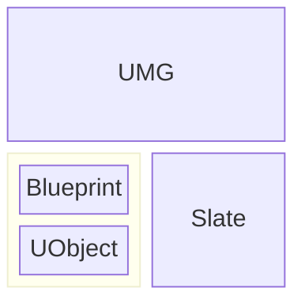
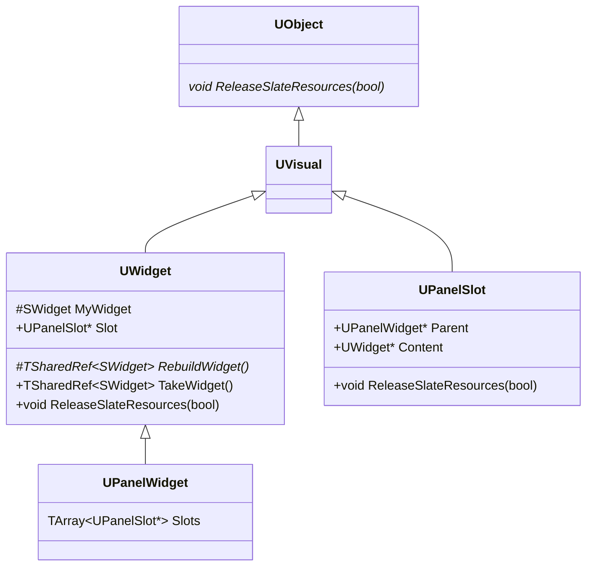
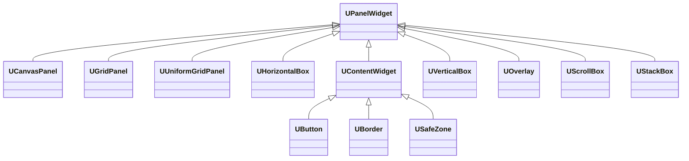
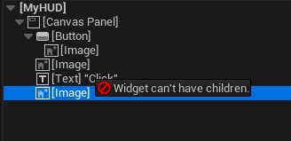
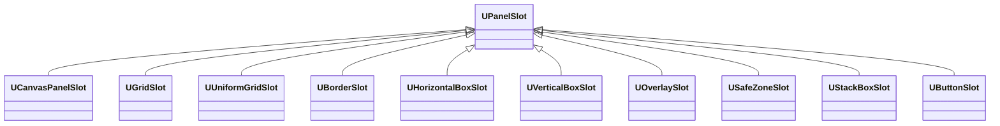
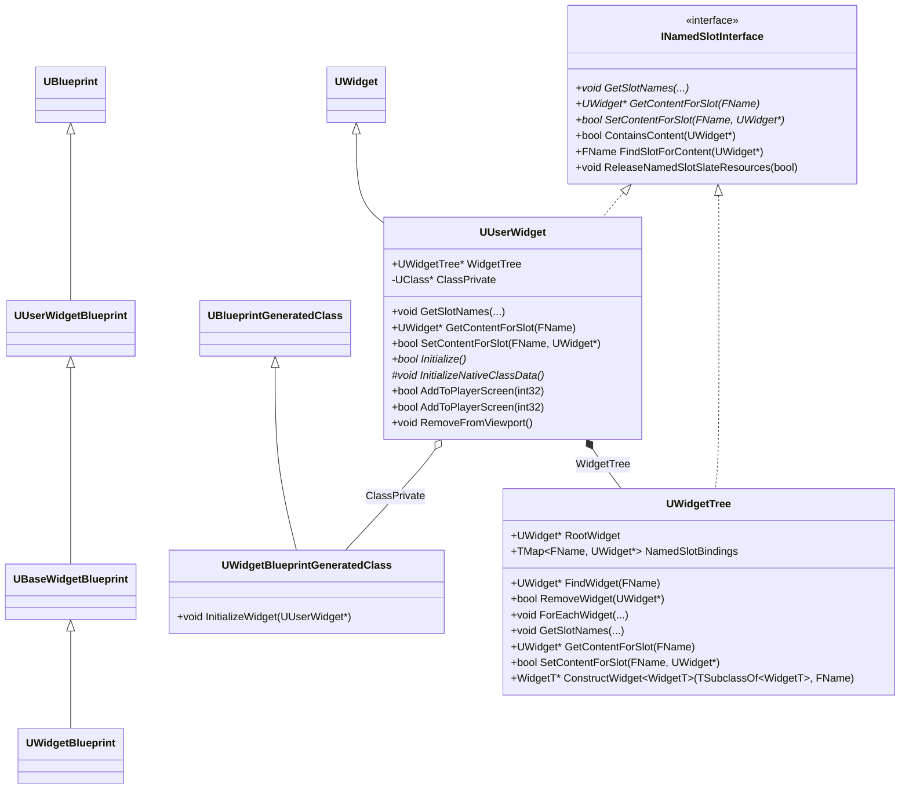
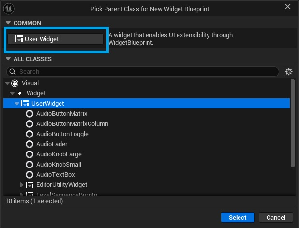
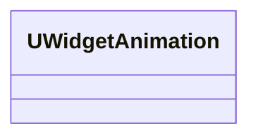

# UMG

UMG（Unreal Motion Graphics）是 Unreal Engine 的游戏 HUD 框架，允许开发者使用蓝图和 C++ 创建用户界面。

UMG 建立在 UObject、Blueprint 和 Slate 之上，UObject 提供反射、序列化和垃圾回收功能，Blueprint 提供可视化编辑和脚本功能，Slate 提供底层的布局、渲染和输入交互功能



## UMG 与 Slate



每个 `UWidget` 通过 `UWidget::Slot` 索引其父 `UPanelWidget`

### UWidget

`UWidget` 是所有 UMG 控件的基类，但它并不继承 `SWidget`，而是 是一个 UObject。`UWidget` 的成员函数 `UWidget::TakeWidget()` 用于获取 `UWidget` 对应的 Slate Widget，如果 Slate Widget 还没有构建，则会调用 `UWidget::RebuildWidget()` 来构建它。 

`UWidget::RebuildWidget()` 是 `UWidget` 的核心虚函数，用于构建 Slate Widget。其实现如下：

```cpp
TSharedRef<SWidget> UWidget::RebuildWidget()
{
    ensureMsgf(false, TEXT("You must implement RebuildWidget() in your child class"));
    return SNew(SSpacer);
}
```

具体地，`USpacer` 的 `RebuildWidget` 函数实现如下：

```cpp
TSharedRef<SWidget> USpacer::RebuildWidget()
{
    MySpacer = SNew(SSpacer)
        .Size(Size);

    return MySpacer.ToSharedRef();
}
```

### UPanelWidget 与 UPanelSlot

`UPanelWidget` 继承自 `UWidget`，是所有 UMG 容器类控件的基类。继承 `UPanelWidget`，实现不同的组件容器。



在 UMG 中，只有继承自 `UPanelWidget` 的控件，才能拥有子控件，而直接继承自 `UWidget` 的控件则不能拥有子控件：




`UPanelSlot` 是构建 UMG Widget 父子关系的桥梁，每个 `UPanelWidget` 都会持有一组 `UPanelSlot`，通过 `UPanelWidget::Slots` 间接引用子 `UWidget`，而每个 `UWidget` 也会通过 `UWidget::Slot` 间接引用父 `UPanelWidget`。`UPanelSlot` 还决定子 `UWidget` 在父 `UPanelWidget` 中的布局方式。通过继承 `UPanelSlot`，可以实现不同容器的布局方式。



> `UPanelSlot` 类似于 Slate UI 中的 Slot，但它们不是同一个层面的概念。`UPanelSlot` 可以看成是 UObject 层面，对 Slate UI Slot 的封装，最终在 `UWidget::RebuildWidget()` 中，`UPanelSlot` 会被转换为 Slate UI Slot。

`UPanelSlot` 重写了的 `ReleaseSlateResources()` 函数实现如下，以便沿 UI 树，释放 Slate UI 资源：

```cpp
void UPanelSlot::ReleaseSlateResources(bool bReleaseChildren)
{
    Super::ReleaseSlateResources(bReleaseChildren);

    // ReleaseSlateResources for Content unless the content is a UUserWidget as they are responsible for releasing their own content.
    if (Content && !Content->IsA<UUserWidget>())
    {
        Content->ReleaseSlateResources(bReleaseChildren);
    }
}
```

## UMG 与 Blueprint



### UUserWidget 与 UWidgetTree


`UWidgetTree` 是 UObject 层面的 UI 树，它保存了根 Widget、提供了对 Widget 的增删改查接口

`UUserWidget` 是 `UWidget` 最重要的派生类，是用户创建的 UI 基类。



`UUserWidget` 内部拥有一个 WidgetTree，在 `RebuildWidget()` 时会将 UMG Widget Tree 转换为 Slate Widget Tree：

```cpp
TSharedRef<SWidget> UUserWidget::RebuildWidget()
{
	check(!HasAnyFlags(RF_ClassDefaultObject | RF_ArchetypeObject));
	
	// In the event this widget is replaced in memory by the blueprint compiler update
	// the widget won't be properly initialized, so we ensure it's initialized and initialize
	// it if it hasn't been.
	if ( !bInitialized )
	{
		Initialize();
	}

	// Setup the player context on sub user widgets, if we have a valid context
	if (PlayerContext.IsValid())
	{
		WidgetTree->ForEachWidget([&] (UWidget* Widget) {
			if ( UUserWidget* UserWidget = Cast<UUserWidget>(Widget) )
			{
				UserWidget->SetPlayerContext(PlayerContext);
			}
		});
	}

	// Add the first component to the root of the widget surface.
	TSharedRef<SWidget> UserRootWidget = WidgetTree->RootWidget ? WidgetTree->RootWidget->TakeWidget() : TSharedRef<SWidget>(SNew(SSpacer));

	return UserRootWidget;
}
```

在 `UUserWidget::Initialize()` 初始化函数中，可以看到 WidgetTree 的初始化：

```cpp
bool UUserWidget::Initialize()
{
    // If it's not initialized initialize it, as long as it's not the CDO, we never initialize the CDO.
    if (!bInitialized && !HasAnyFlags(RF_ClassDefaultObject))
    {
        // If this is a sub-widget of another UserWidget, default designer flags and player context to match those of the owning widget
        if (UUserWidget* OwningUserWidget = GetTypedOuter<UUserWidget>())
        {
    #if WITH_EDITOR
            SetDesignerFlags(OwningUserWidget->GetDesignerFlags());
    #endif
            SetPlayerContext(OwningUserWidget->GetPlayerContext());
        }

        UWidgetBlueprintGeneratedClass* BGClass = Cast<UWidgetBlueprintGeneratedClass>(GetClass());
        // Only do this if this widget is of a blueprint class
        if (BGClass)
        {
            BGClass->InitializeWidget(this);
        }
        else
        {
            InitializeNativeClassData();
        }

        if ( WidgetTree == nullptr )
        {
            WidgetTree = NewObject<UWidgetTree>(this, TEXT("WidgetTree"), RF_Transient);
        }
        else
        {
            WidgetTree->SetFlags(RF_Transient);

            InitializeNamedSlots();
        }

        // For backward compatibility, run the initialize event on widget that doesn't have a player context only when the class authorized it.
        bool bClassWantsToRunInitialized = BGClass && BGClass->bCanCallInitializedWithoutPlayerContext;
        if (!IsDesignTime() && (PlayerContext.IsValid() || bClassWantsToRunInitialized))
        {
            NativeOnInitialized();
        }

        bInitialized = true;
        return true;
    }

    return false;
}

void UUserWidget::InitializeNamedSlots()
{
    for (const FNamedSlotBinding& Binding : NamedSlotBindings )
    {
        if ( UWidget* BindingContent = Binding.Content )
        {
            FObjectPropertyBase* NamedSlotProperty = FindFProperty<FObjectPropertyBase>(GetClass(), Binding.Name);
    #if !WITH_EDITOR
            // In editor, renaming a NamedSlot widget will cause this ensure in UpdatePreviewWidget of widget that use that namedslot
            ensure(NamedSlotProperty);
    #endif
            if ( NamedSlotProperty ) 
            {
                UNamedSlot* NamedSlot = Cast<UNamedSlot>(NamedSlotProperty->GetObjectPropertyValue_InContainer(this));
                if ( ensure(NamedSlot) )
                {
                    NamedSlot->ClearChildren();
                    NamedSlot->AddChild(BindingContent);
                }
            }
        }
    }
}
```

`UUserWidget` 和 WidgetTree 在 [UMG 界面设计器（Unreal Motion Graphics UI Designer）](https://dev.epicgames.com/documentation/unreal-engine/umg-ui-designer-quick-start-guide-in-unreal-engine?application_version=5.5)中编辑。

## UMG 与 C++

## UMG 与 Animation

